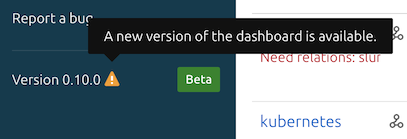

(manage-the-juju-dashboard)=
# How to manage the Juju dashboard

> See also: {ref}`juju-dashboard`, [Charmhub | `juju-dashboard`](https://charmhub.io/juju-dashboard)

This document demonstrates how to use Juju Dashboard.

```{caution}
Starting with `juju v.3.0`,  Juju Dashboard needs to be set up via the `juju-dashboard` charm. (Previously it came automatically with every controller.)
> See more: [Charmhub | `juju-dashboard`](https://charmhub.io/juju-dashboard)

```

(set-up-the-juju-dashboard)=
## Set up the Juju dashboard

First, switch to the controller model (always called `controller`; see `juju status`):

```text
juju switch controller
```

Then, deploy the charm. For machine charms deploy [`juju-dashboard`](https://charmhub.io/juju-dashboard):

```text
juju deploy juju-dashboard
```

For Kubernetes deploy [`juju-dashboard-k8s`](https://charmhub.io/juju-dashboard-k8s):

```text
juju deploy juju-dashboard-k8s
```

Next, integrate it with the controller application (always called `controller`; see `juju status`):

```text
juju integrate juju-dashboard controller
```

Now, expose the `juju-dashboard` application:

```text
juju expose juju-dashboard
```

Your application is now ready to be accessed.

(access-the-juju-dashboard)=
## Access the Juju dashboard

### Using the CLI

First, use the `dashboard` command to get the IP address and login credentials to access the dashboard. This command will need to be run on the same machine as your browser as it will proxy a secure connection to the controller.

```text
juju dashboard
```

This will produce output similar to the following:

```text
Dashboard for controller "my-controller" is enabled at:

https://10.55.60.10:17070/dashboard

Your login credential is:

username: admin

password: 1d191f0ef257a3fc3af6be0814f6f1b0
```

> See more: {ref}`command-juju-dashboard`

Now copy-paste the URL into the browser to access the dashboard.

```{important}

If you don't want to copy and paste the URL manually, typing `juju dashboard --browser` will open the link in your default browser automatically.

```

Your browser will give you an error message when you open the URL warning that the site certificate should not be trusted. This is because Juju is generating a self-signed SSL certificate rather than one from a certificate authority (CA). Depending on your browser, choose to manually proceed or add an exception to continue past the browser's error page.

After opening the Juju dashboard URL, you are greeted with the login window, where you will have to provide the credentials to access the model. These credentials can be copied from the output of `juju dashboard`.

If you'd rather not have your login credentials displayed in the output of `juju dashboard`, they can be suppressed by adding the `--hide-credential` argument.

(access-the-juju-dashboard-without-the-cli)=
### Without the CLI

If you would like Juju Dashboard to be available without using the CLI to proxy your connection, you will need to set up a web proxy (e.g. [HAProxy](https://charmhub.io/haproxy)) in front on the dashboard and Juju controller API.

(upgrade-the-juju-dashboard)=
## Upgrade the Juju dashboard

The dashboard might inform you that a newer version is available.



If you have permission to modify the controller model you can upgrade the dashboard application charm.

First, switch to the controller model:

```text
juju switch controller
```

Get the name of the Juju Dashboard application from `juju status` and look for the application with the juju-dashboard or juju-dashboard-k8s charm:

```text
juju status
```

To upgrade the dashboard to the latest version in the current channel run:

```text
juju refresh [dashboard-app-name]
```

If you want to see what other channels are available run the following if you're using machine charms:

```text
juju info juju-dashboard
```

For Kubernetes deployments run:

```text
juju info juju-dashboard-k8s
```

You can change channels by specifying the new channel e.g.:

```text
juju refresh [dashboard-app-name] --channel=latest/beta
```

> See more: {ref}`command-juju-refresh`
