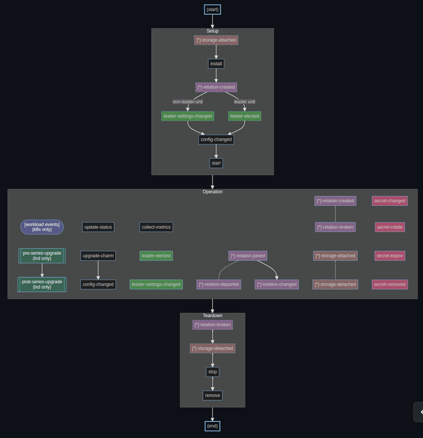
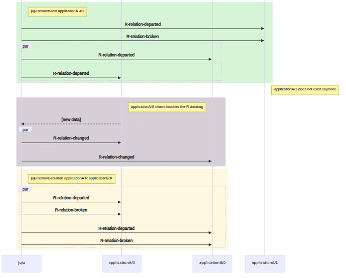
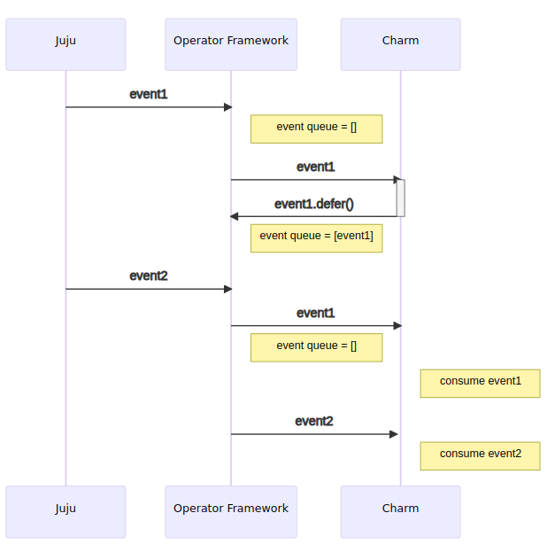
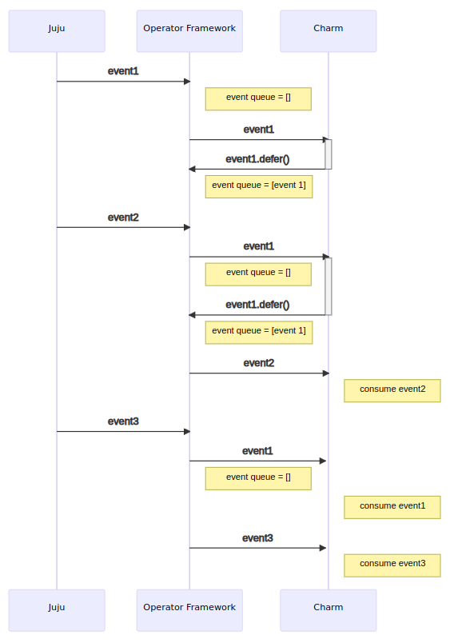

(hook)=
# Hook

In Juju, a **hook** is a notification from  the controller agent through the unit agent to the charm that the internal representation of Juju has changed in a way that requires a reaction from the charm so that the unit's state and the controller's state can be reconciled.


For a charm written with [Ops](https://ops.readthedocs.io/en/latest/), Juju hooks are translated into Ops events, specifically, into classes that inherit from [`HookEvent`](https://ops.readthedocs.io/en/latest/reference/ops.html#ops.HookEvent).

Whenever a hook event is received, the associated event handler should ensure the current charm configuration is properly reflected in the underlying application configuration.
Invocations of associated handlers should be idempotent and should not make changes to the environment, or restart services, unless there is a material change to the charm's configuration, such as a change in the port exposed by the charm, addition or removal of a relation which may require a database migration or a "scale out" event for high availability, or similar.

Handlers must not assume that the underlying applications or services have been started and should not assume anything about order of hook execution, except in limited situations described below.

<!--
(charm-lifecycle)=
## Charm lifecycle

This document is about the lifecycle of a charm, specifically the Juju events that are used to keep track of it. These events are relayed to charm code by the Operator Framework in specific sequences depending on what's going on in the Juju model.

It is common wisdom that event ordering should not be generally relied upon when coding a charm, to ensure resilience. It can be however useful to understand the logic behind the timing of events, so as to avoid common mistakes and have a better picture of what is happening in your charm. In this document we'll learn how:

* A charm's lifecycle can be seen to consist of three **phases**, each one with characteristic events and sequences thereof. The fuzziest of the three being the Operation phase, where pretty much anything can happen short of setup events.
* Not all events can be reliably be assumed to occur in specific temporal orders, but some can.

In this document we will *not* learn:

* What each event means or is typically used to represent about a workload status. For that see [the SDK docs](https://juju.is/docs/sdk/events).
* What event cascades are triggered by a human administrator running commands through the Juju CLI. For that see [this other doc](https://discourse.charmhub.io/t/core-lifecycle-events/4455/3).

```{note}

The graphs are screenshots of mermaid sources currently available [here](https://github.com/PietroPasotti/charm-events), pending mermaid support to be available on discourse.

```


### The graph



#### Legend

* `(start)` and `(end)` are 'meta' nodes and represent the beginning and end of the lifecycle of a Charm/juju unit. All other nodes represent hooks (events) that can occur during said lifecycle.
* Hard arrows represent strict temporal ordering which is enforced by the Juju state machine and respected by the Operator Framework, which mediates between the Juju controller and the Charm code.
* Dotted arrows represent a 1:1 relationship between relation events, explained in more detail down in the Operation section.
* The large yellow boxes represent broad phases in the lifecycle. You can read the graph as follows: when you fire up a unit, there is first a setup phase, when that is done the unit enters a operation phase, and when the unit goes there will be a sequence of teardown events. Generally speaking, this guarantees some sort of ordering of the events: events that are unique to the teardown phase can be guaranteed not to be fired during the setup phase. So a `stop` will never be fired before a `start`.
* The colours of the event nodes represent a logical but practically meaningless grouping of the events.
  * green for leadership events
  * red for storage events
  * purple for relation events
  * blue for generic lifecycle events

#### Workload and substrate-specific events

Note the `[workload events] (Kubernetes only)` node in the operation phase. That represents all events meant to communicate information about the workload container on kubernetes charms. At the time of writing the only such events are:

* [`*-pebble-ready` <event-container-pebble-ready>`
* {ref}``*-pebble-custom-notice` <event-container-pebble-custom-notice>`
* [`*-pebble-check-failed`](https://ops.readthedocs.io/en/latest/#ops.PebbleCheckFailedEvent)
* [`*-pebble-check-recovered`](https://ops.readthedocs.io/en/latest/#ops.PebbleCheckRecoveredEvent)

All of these can fire at any time whatsoever during the lifecycle of a charm.

Similarly, the `{ref}`pre/post]-series-upgrade (lxd only)` events can only occur on machine charms at any time during the operation phase.

## Notes on the setup phase
* The only events that are guaranteed to always occur during Setup are [`start`], [`config-changed`] and [`install`]. The other events only happen if the charm happens to have (peer) relations at install time (e.g. if a charm that already is related to another gets scaled up) or it has storage. Same goes for leadership events. For that reason they are styled with dashed borders.
* [`config-changed`] occurs between [`install`] and [`start`] regardless of whether any leadership (or relation) event fires.
* Any [`*-relation-created`] event can occur at Setup time, but if X is a peer relation, then `X-relation-created` can **only** occur at Setup, while for non-peer relations, they can occur also during Operation. The reason for this is that a peer relation cannot be created or destroyed 'manually' at arbitrary times, they either exist or not, and if they do exist, then we know it from the start.

### Notes on the operation phase

* [`update-status` <event-update-status>` is fired automatically and periodically, at a configurable regular interval (default is 5m) which can be configured by `juju model-config update-status-hook-interval`.
`collect-metrics` is fired automatically and periodically in older Juju versions, at a regular interval of 5m, AND whenever the user runs `juju collect-metrics`.
* [`leader-elected`] and [`leader-settings-changed`] only fire on the leader unit and the non-leader unit(s) respectively, just like at startup.
* There is a square of symmetries between the `*-relation-[joined/departed/created/broken]` events:
  * Temporal ordering: a `X-relation-joined` cannot *follow* a `X-relation-departed` for the same relation ID. Same goes for [`*-relation-created`] and [`*-relation-broken`], as well as [`*-relation-created`] and [`*-relation-changed`].
  * Ownership: `joined/departed` are unit-level events: they fire when an application has a (peer) relation and a new unit joins or leaves. All units (including the newly created or leaving unit), will receive the event. `created/broken` are relation-level events, in that they fire when two applications become related or a relation is removed (e.g. via `juju remove-relation` or because an application is destroyed).
  * Number: there is a 1:1 relationship between `joined/departed` and `created/broken`: when a unit joins a relation with X other units, X [`*-relation-joined`] events will be fired. When a unit leaves, all units will receive a [`*-relation-departed`] event (so X of them are fired). Same goes for `created/broken` when two applications are related or a relationship is broken. Find in appendix 1 a somewhat more elaborate example.
* Technically speaking all events in this box are optional, but I did not style them with dashed borders to avoid clutter. If the charm shuts down immediately after start, it could happen that no operation event is fired.
* A `X-relation-joined` event is always followed up (immediately after) by a `X-relation-changed` event. But any number of [`*-relation-changed`] events can be fired at any time during operation, and they need not be preceded by a [`*-relation-joined`] event.
* There are more temporal orderings than the one displayed here; event chains can be initiated by human operation as detailed [in the SDK docs](https://juju.is/docs/sdk/events) and [the leadership docs](https://juju.is/docs/sdk/leadership). For example, it is guaranteed that a [`leader-elected`] is always followed by a [`settings-changed`], and that if you remove the leader unit, you should get [`*-relation-departed`] and a [`leader-settings-changed`] on the remaining units (although no specific ordering can be guaranteed [cfr this bug...](https://bugs.launchpad.net/juju/+bug/1964582)).
* Secret events (in purple) can technically occur at any time, provided your charm either has created a secret, or consumes a secret that some other charm has created. Only the owner of a secret can receive `secret-rotate`, `secret-remove` and `secret-expire` for that secret, and only a consumer of a secret can receive `secret-changed`.

### Notes on the teardown phase

* Both relation and storage events are guaranteed to fire before [`stop`]/[`remove`] if they will fire at all. They are optional, in that a departing unit (or application) might have no storage or relations.
* [`*-relation-broken`] events in the Teardown phase are fired in case an application is being torn down. These events can also occur at Operation time, if the relation is removed by e.g. a charm or a controller.
* The entire teardown phase is **skipped** if the cloud is killed. The next event the charm will see in this case would be a `start` event. This would happen, for example, on `microk8s stop; microk8s start`.

### Caveats

* Events can be deferred by charm code by calling `Event.defer()`. That means that the event is put in a queue of deferred events which will get flushed by the operator framework as soon as the next event comes in, and *before* firing that new event in turn. See Appendix 2 for a visual representation. What this means in practice is that deferring an event can break the temporal ordering of the events as outlined in this graph; `defer()`ring an event twice will break the ordering guarantees we outlined here. Cf. the appendix for an UML-y representation. Cfr [this document on defer](https://discourse.charmhub.io/t/deferring-events-details-and-dilemmas/5930) for more.
* The events in the Operation phase can interleave in arbitrary ways. For this reason it's essential that hook handlers make *no assumptions* about each other -- each handler should check its preconditions independently and operate under the assumption that the relative ordering is totally arbitrary -- except relation events, which have some partial ordering as explained above.

### Deprecation notices

* `leader-deposed` is a Juju hook that was planned but never actually implemented. You may see a WARNING mentioning it in the `juju debug-log` but you can ignore it.
* [`collect-metrics`](https://discourse.charmhub.io/t/charm-hooks/1040#heading--collect-metrics) is no longer being fired in recent Juju versions.

### Event semantics and data

This document is only about the timing of the events; for the 'meaning' of the events, other sources are more appropriate; e.g. [juju-events](https://juju.is/docs/sdk/events).
For the data attached to an event, one should refer to the docstrings in the ops.charm.HookEvent subclass that the event you're expecting in your handler inherits from.


## Appendices

### Appendix 1: scenario example


This is a representation of the relation events a deployment will receive in a simple scenario that goes as follows:
* We start with two unrelated applications, `applicationA` and `applicationB`, with one unit each.
* `applicationA` and `applicationB` become related via a relation called `R`.
* `applicationA` is scaled up to 2 units.
* `applicationA` is scaled down to 1 unit.
* `applicationA` touches the `R` databag (e.g. during an `update-status` hook, or as a result of a `config-changed`, an action, a custom event...).
* The relation `R` is removed.

Note that many event sequences are marked as 'par' for *parallel*, which means that the events can be dispatched to the units arbitrarily interleaved.




### Appendix 2: deferring an event

 > {ref}`jhack tail <explore-event-emission-with-jhack-tail>` offers functionality to visualize the deferral status of events in real time.

This is the 'normal' way of using `defer()`: an event `event1` comes in but we are not ready to process it; we `defer()` it; when `event2` comes in, the operator framework will first flush the queue and fire `event1`, then fire `event2`. The ordering is preserved: `event1` is consumed before `event2` by the charm.



Suppose now that the charm defers `event1` again; then `event2` will be processed by the charm before `event1` is. `event1` will only be fired again once another event, `event3`, comes in in turn.
The result is that the events are consumed in the order: `2-1-3`. Beware.




-->

## Hook kinds

All hooks share a lot of common behaviour in terms of the environment in which they run, how charms
are notified that a hook event has occurred, how errors are reported, and how a user might respond to
a unit being in an error state due to a failed hook execution etc.

Some hooks can also be grouped according to the Juju subsystem they represent. The hook kinds are:

* relation: used to inform a charm about changes to related applications and units
* secret: used to inform a charm about changes to secrets it either owns or has consumed
* storage: used to inform a charm about changes to storage attached to its unit
* upgrade series: used to coordinate upgrade of host OS (3.6 or earlier only)
* workload: used to inform the charm about events related to a Pebble managed workload (currently Kubernetes only)

The documentation in this section will, where relevant, describe behaviour specific to particular hook kinds.

(hook-execution)=
## Hook execution

Hooks are run with environment variables set by Juju to expose relevant contextual configuration to the charm.
The Juju environment variables are set in addition to those supplied by the execution environment itself.

```{tip}
For the curious, or to debug charm behaviour, the environment variables for a specific event
can be obtained by running

    juju debug-hooks <unit name>

and waiting for the desired event to fire. If the next prompt looks as below

    root@database-0:/var/lib/juju#

meaning that we are still waiting for an event to occur.

As soon as that happens, the prompt will look similar to the below

    root@database-0:/var/lib/juju/agents/unit-database-0/charm#

meaning we're inside the charm hook execution context.

At this point,  typing `printenv` will print out the environment variables.

> See more: {ref}`debug-a-charm`
```

The following environment variables are set for every hook:

* PATH is the usual Unix path, prefixed by a directory containing command line tools through which the hooks can interact with Juju.
* JUJU_CHARM_DIR holds the path to the charm directory.
* JUJU_HOOK_NAME holds the name of the currently executing hook.
* JUJU_UNIT_NAME holds the name of the local unit.
* JUJU_CONTEXT_ID, JUJU_AGENT_SOCKET_NETWORK and JUJU_AGENT_SOCKET_ADDRESS are set (but should not be messed with: the command line tools won't work without them).
* JUJU_API_ADDRESSES holds a space separated list of Juju API addresses.
* JUJU_MODEL_UUID holds the UUID of the current model.
* JUJU_MODEL_NAME holds the human friendly name of the current model.
* JUJU_PRINCIPAL_UNIT holds the name of the principal unit if the current unit is a subordinate.
* JUJU_MACHINE_ID holds the ID of the machine on which the local unit is running.
* JUJU_AVAILABILITY_ZONE holds the cloud's availability zone where the machine has been provisioned.
* CLOUD_API_VERSION holds the API version of the cloud endpoint.
* JUJU_VERSION holds the version of the model hosting the local unit.
* JUJU_CHARM_HTTP_PROXY holds the value of the `juju-http-proxy` model config attribute.
* JUJU_CHARM_HTTPS_PROXY holds the value of the `juju-https-proxy` model config attribute.
* JUJU_CHARM_FTP_PROXY holds the value of the `juju-ftp-proxy` model config attribute.
* JUJU_CHARM_NO_PROXY holds the value of the `juju-no-proxy` model config attribute.

Additionally, hooks will have extra environment variables set which correspond to the kind of hook.
The operation of each hook kind is explained in the following sections, including any relevant additional environment variables.

## Hook ordering

A charm's lifecycle consists of distinct **phases**:
* installation
* operation
* upgrade
* teardown

Generally, no assumptions can be made about the order of hook execution. However, there are some limited guarantees
about hook sequencing during install, upgrade, and relation removal.

In normal operation, a unit will run at least the `install`, `start`, `config-changed` and `stop` hooks over the course of its lifetime.

(installation-phase)=
### Installation phase

When a charm is first deployed, the following hooks are executed in order before a charm reaches its operation phase:

* storage-attached (for machine charms if the unit has storage)
* install
* leader-elected (if the unit is a leader)
* config-changed
* start

```{note}
Only machine charms have the behaviour where the `storage-attached` hook must run before the `install` hook.
See {ref}`storage hooks <storage-hooks>` for more details.
```

(operation-phase)=
### Operation phase

This phase occurs when a charm has completed its installation operations and starts responding to events which correspond to interesting (relevant) changes to the Juju model.
The behaviour when in this phase can be explained by understanding the events which trigger the execution of the different hook kinds, and the context in which the hooks execute.
This is covered in subsequent sections where hook kinds are explored in more detail.

(upgrade-phase)=
### Upgrade phase

When a charm is upgraded, the `upgrade-charm` hook is followed by a `config-changed` hook.

The `upgrade-charm` hook always runs once immediately after the charm directory
contents have been changed by an unforced charm upgrade operation, and *may* do
so after a forced upgrade; but will *not* be run after a forced upgrade from an
existing error state. (Consequently, neither will the `config-changed` hook that
would ordinarily follow the upgrade-charm.)

(teardown-phase)=
### Teardown phase

When a unit is to be removed, the following hooks are executed:

* `stop`
* `storage-detaching` | `relation-broken` (in any order)
* `remove`

The `remove` event is the last event a unit will ever see before being removed.

## Errors in hooks

Hooks should ideally be idempotent, so that they can fail and be re-executed
from scratch without trouble. Charm code in hooks does not have complete control
over the times the hook might be unexpectedly aborted: if the unit agent process is
killed for any reason while running a hook, then when it recovers it will treat that
hook as having failed -- just as if it had returned a non-zero exit code -- and
request user intervention.

Hooks should be written to expect that users could (and probably will) attempt to
re-execute failed hooks before attempting to investigate or understand the situation.
Hook code should therefore make every effort to ensure hooks are idempotent when
aborted and restarted.

The most sophisticated charms will consider the nature of their operations with
care, and will be prepared to internally retry any operations they suspect of
having failed transiently (to ensure that they only request user intervention in
the most trying circumstances) as well as careful to log any relevant
information or advice before signalling the error.

## Hooks in detail

This section describes the workflows and associated hook events which are important to the operation of Juju.

(relation-hooks)=
### Relation hooks

When an application becomes involved in a relation, each one of its units will start to receive relevant hook events
for that relation.

For every endpoint defined by a charm, relation hook events are named after the charm endpoint:

* `<endpoint_name>-relation-created`
* `<endpoint_name>-relation-joined`
* `<endpoint_name>-relation-changed`
* `<endpoint_name>-relation-departed`
* `<endpoint_name>-relation-broken`

For each charm endpoint, any or all of the above relation hooks can be implemented.
Relation hooks operate in an environment with additional environment variables available:

* `JUJU_RELATION` holds the name of the relation. This is of limited value, because every relation hook already "knows" what charm relation it was written for; that is, in the `foo-relation-joined` hook, JUJU_RELATION is `foo`.
* `JUJU_RELATION_ID` holds the ID of the relation. It is more useful, because it serves as unique identifier for a particular relation, and thereby allows the charm to handle distinct relations over a single endpoint. In hooks for the `foo` charm relation, JUJU_RELATION_ID always has the form "foo:<id>", where id uniquely but opaquely identifies the runtime relation currently in play.
* `JUJU_REMOTE_APP` holds the name of the related application.

Furthermore, all relation hooks except `relation-created` and `relation-broken` are notifications about some specific unit of a related application, and operate in an environment with the following additional environment variables available:

* `JUJU_REMOTE_UNIT` holds the name of the current related unit.

For every relation in which a unit participates, hooks for the appropriate charm relation are run according to the following rules.

The `relation-created` hook always runs once when the relation is first created, before any related units are processed.

The `relation-joined` hook always runs once when a related unit is first seen.
As related applications are scaled up, each unit will receive `<endpoint>-relation-joined`, once for each related unit being added.

The `relation-changed` hook for a given unit always runs once immediately following the relation-joined hook for that unit, and subsequently whenever the related unit changes its settings (by calling relation-set and exiting without error).

```{note}
"Immediately" only applies within the context of this particular relation - that is, when
"foo-relation-joined" is run for unit "bar/99" in relation id "foo:123", the only guarantee is that
the next hook to be run *in relation id "foo:123"* will be "foo-relation-changed" for "bar/99".
Non-relation hooks may intervene, as may hooks for other relations, and even for other "foo" relations.
```

The `relation-departed` hook for a given unit always runs once when a related unit is no longer related.
Any time a related applications is scaled down, each unit will receive `<endpoint>-relation-departed`, once for each related unit being removed.
After the `relation-departed` hook has run, no further notifications will be received from that unit; however, its settings will remain accessible
via relation-get for the complete lifetime of the relation. It's also still possible to call `relation-set`.
This hook also sets an additional environment variable:

* JUJU_DEPARTING_UNIT holds the name of the related unit departing the relation.

The `relation-broken` hook is not specific to any unit, and always runs once when the local unit is ready to depart the relation itself.
Before this hook is run, a relation-departed hook will be executed for every unit known to be related; it will never run while the relation
appears to have members, but it may be the first and only hook to run for a given relation.
The `stop` hook will not run until all relations have run the `relation-broken` hook.

```{note}
So what's the difference between relation-departed and relation-broken?
Think of relation-departed as the "saying goodbye" event; relation settings can still be read and a relation can even still be set.
Once relation-broken fires, however, the relation no longer exists. This is a good spot to do any final cleanup, if necessary.
Both relation-departed and relation-broken will always fire, regardless of how the relation is terminated.
```

(secret-hooks)=
### Secret hooks

Secret hooks operate in an environment with additional environment variables available:

* `JUJU_SECRET_ID` holds the ID of the secret.
* `JUJU_SECRET_LABEL` holds the label of the secret.
* `JUJU_SECRET_REVISION` holds the revision of the secret.

Secret hooks are used to:
* inform the owner of a secret that a revision should be removed because it has expired.
* inform the owner of a secret that it should be rotated because it has become stale.
* inform the owner of a secret that unused revisions can safely be removed.
* inform the consumer of a secret that a new revision is available.

The `secret-expired` hook is triggered when the secret's expiry time has been reached and the expired secret revision should be removed.

The `secret-rotate` hook is triggered when a secret has become stale at the end of its rotation interval and a new revision should be created.

The `secret-remove` hook is triggered when there are revisions of a secret that are no longer being tracked by any consumers and can be safely removed.

The `secret-changed` hook is triggered when there is a new revision available for a previously consumed secret.

(storage-hooks)=
### Storage hooks

The hook names that these kinds represent will be prefixed by the storage name; for example, `database-storage-attached`.

For every storage defined by a charm, storage hook events are named after the storage name:

* `<storage_name>-storage-attached`
* `<storage_name>-storage-detaching`

For each charm storage, any or all of the above storage hooks can be implemented.
Storage hooks operate in an environment with additional environment variables available:

* `JUJU_STORAGE_ID` holds the ID of the storage.
* `JUJU_STORAGE_LOCATION` holds the path at which the storage is mounted.
* `JUJU_STORAGE_KIND` holds the kind of storage (`block` or `filesystem`).

The `storage-attached` hook is triggered when new storage is available for the charm to use.

```{note}
For machine charms, all `storage-attached` hooks will be run before the `install` event fires.
This means that if any errors are encountered whilst performing the storage provisioning and attach operations, the charm will
not receive the `install` event until such errors have been resolved.

For Kubernetes charms, any `storage-attached` hooks are run some time after the `start` hook has completed.
```

The `storage-detaching` hook is triggered after the `stop` hook has completed and all such hooks will be run before triggering the `remove` hook.

### Upgrade series hook

This hook is run to inform the charm the version of the underlying OS will be upgraded.

Upgrade series hooks operate in an environment with additional environment variables available:

* `JUJU_TARGET_BASE` holds the target base for the machine.

### Workload (pebble) hooks

The hook names that these kinds represent will be prefixed by the workload/container name; for example, `mycontainer-pebble-ready`.

Workload hooks operate in an environment with additional environment variables available:

* `JUJU_WORKLOAD_NAME` holds the name of the container to which the hook pertains.
* `JUJU_NOTICE_ID` holds the Pebble notice ID.
* `JUJU_NOTICE_TYPE` holds the Pebble notice type.
* `JUJU_NOTICE_KEY` holds the Pebble notice key.
* `JUJU_PEBBLE_CHECK_NAME` holds the name of the Pebble check.

## List of hooks

> [Source](https://github.com/juju/juju/blob/main/internal/charm/hooks/hooks.go)

(hook-config-changed)=
### `config-changed`

*What triggers it?*

The `config-changed` hook always runs once immediately after the initial `install`, `leader-elected` hooks, and likewise after the `upgrade-charm` hook.

It also runs whenever:
* application configuration changes.
* when any IP address of the machine hosting the unit changes.
* when the trust value of the application changes.
* when recovering from transient unit agent errors.

*Which environment variables is it executed with?*

All {ref}`the generic environment variables <hook-execution>`.

*Who gets it*?

When application config or trust has changed, all the units of an application for which the config has changed.
When the networking on a machine has changed, any units deployed to that machine.


<!--
#### Pebble hooks
> These hooks require an associated workload/container, and the name of the workload/container whose change triggered the hook. The hook file names that these kinds represent will be prefixed by the workload/container name; for example, `mycontainer-pebble-ready`.
-->

(hook-container-pebble-check-failed)=
### `<container>-pebble-check-failed`
> Kubernetes sidecar charms only.
>
> Added in Juju 3.6.

*What triggers it?*

A Pebble check passing the failure threshold.

*Which environment variables is it executed with?*

All {ref}`the generic environment variables <hook-execution>` and:

* $JUJU_WORKLOAD_NAME holds the name of the container to which the hook pertains.
* $JUJU_PEBBLE_CHECK_NAME holds the name of the Pebble check.

*Who gets it*?

The charm responsible for the container to which the hook pertains.

(hook-container-pebble-check-recovered)=
### `<container>-pebble-check-recovered`
> Kubernetes sidecar charms only.
>
> Added in Juju 3.6.

*What triggers it?*

A Pebble check passing after previously reaching the failure threshold.

*Which environment variables is it executed with?*

All {ref}`the generic environment variables <hook-execution>` and:

* $JUJU_WORKLOAD_NAME holds the name of the container to which the hook pertains.
* $JUJU_PEBBLE_CHECK_NAME holds the name of the Pebble check.

*Who gets it*?

The charm responsible for the container to which the hook pertains.

(hook-container-pebble-custom-notice)=
### `<container>-pebble-custom-notice`
> Kubernetes sidecar charms only

*What triggers it?*

A Pebble notice of type "custom" occurring.

*Which environment variables is it executed with?*

All {ref}`the generic environment variables <hook-execution>` and:

* `JUJU_WORKLOAD_NAME` holds the name of the container to which the hook pertains.
* `JUJU_NOTICE_ID` holds the Pebble notice ID.
* `JUJU_NOTICE_TYPE` holds the Pebble notice type.
* `JUJU_NOTICE_KEY` holds the Pebble notice key.

*Who gets it*?

The charm responsible for the container to which the hook pertains.

(hook-container-pebble-ready)=
### `<container>-pebble-ready`
> Kubernetes sidecar charms only.

*What triggers it?*

The requested container being ready.

The `pebble-ready` event doesn't guarantee the workload container is *still* up. For example, if you manually `kubectl patch` during (for example) `install`, then you may receive this event after the old workload is down but before the new one is up.
For this reason it's essential, even in `pebble-ready` event handlers, to catch [`ConnectionError`](https://ops.readthedocs.io/en/latest/reference/pebble.html#ops.pebble.ConnectionError) when using Pebble to make container changes. There is a [`Container.can_connect`()](https://ops.readthedocs.io/en/latest/reference/ops-testing.html#ops.testing.Container.can_connect) method, but note that this is a point-in-time check, so just because `can_connect()` returns `True` doesn’t mean it will still return `True` moments later. So, **code defensively** to avoid race conditions.

Moreover, as pod churn can occur at any moment, `pebble-ready` events can be received throughout any phase of a charm's lifecycle. Each container could churn multiple times, and they all can do so independently from one another. In short, the charm should make no assumptions at all about the moment in time at which it may or may not receive `pebble-ready` events, or how often that can occur. The fact that the charm receives a `pebble-ready` event indicates that the container has just become ready (for the first time, or again, after pod churn), therefore you typically will need to **reconfigure your workload from scratch** every single time.

This feature of `pebble-ready` events make them especially suitable for a [holistic handling pattern](https://ops.readthedocs.io/en/latest/explanation/holistic-vs-delta-charms.html).


*Which environment variables is it executed with?*

* $JUJU_WORKLOAD_NAME holds the name of the container to which the hook pertains.

*Who gets it*?

The charm responsible for the container to which the hook pertains.

<!--

<a href="#heading--relation-event-triggers"><h2 id="heading--relation-event-triggers">Relation event triggers</h2></a>

Relation events trigger as a response to changes in the Juju model relation topology. When a new relation is created or removed, events are fired on all units of both involved applications.

|   Scenario  | Example Command                          | Resulting Events                     |
| :-------: | ---------------------------------------- | ------------------------------------ |
|  Relate   | `juju integrate foo:a bar:b`     | `(foo): a-relation-created -> a-relation-changed`<br> `(bar): b-relation-created -> b-relation-changed` |
|  Remove relation   | `juju remove-relation foo:a bar:b`     | `(foo): a-relation-broken`<br> `(bar): b-relation-broken` |

If you have two already related applications, and one of them gains or loses a unit, then the newly added unit will receive the same event sequences as if it had just been related (from its point of view, the relation is 'brand new'), while the units that were there already receive a `-relation-joined` event.
Similarly if a unit is removed, that unit will receive `-relation-broken`, while the ones that remain will see a `-relation-departed`.

|  Scenario   | Example Command                          | Resulting Events                     |
| :-------: | ---------------------------------------- | ------------------------------------ |
|  Add unit   | `juju add-unit foo -n 1`     | `(foo): a-relation-created -> a-relation-changed`<br> `(bar): b-relation-joined -> b-relation-changed` |
|  Remove relation   | `juju remove-unit foo:a --num-units 1`     | `(foo): a-relation-broken`<br> `(bar): b-relation-departed` |

```{note}

`-relation-changed` events are not only fired as part of these event sequences, but also whenever a unit touches the relation data.
As such, contrary to many other events, `-relation-changed` events are mostly triggered by charm code (and not by the cloud admin doing things on the Juju model).

```
-->


(hook-relation-broken)=
### `<endpoint>-relation-broken`

*What triggers it?*

- a non-peer relation being removed;
- a unit participating in a non-peer relation being removed, even if the relation is otherwise still alive (through other units); or
- an application involved in a non-peer relation being removed.

This hook is fired only once per unit per relation and is the exact inverse of `relation-created`. `relation-created` indicates that relation data can be accessed; `relation-broken` indicates that relation data can no longer be read-written.

The hook indicates that the relation under consideration is no longer valid, and that the charm’s software must be configured as though the relation had never existed. It will only be called after every hook bound to `<endpoint>-relation-departed` has been run. If a hook bound to this event is being executed, it is guaranteed that no remote units are currently known locally.


> It is important to note that the `relation-broken` hook might run even if no other units have ever joined the relation. This is not a bug: even if no remote units have ever joined, the fact of the unit’s participation can be detected in other hooks via the `relation-ids` tool, and the `-broken` hook needs to execute to allow the charm to clean up any optimistically-generated configuration.

> Also, it’s important to internalise the fact that there may be multiple relations in play with the same name, and that they’re independent: one `relation-broken` hook does not mean that *every* such relation is broken.

> For a peer relation, `<peer endpoint name>-relation-broken` will never fire, not even during the teardown phase.

<!--
*Which hooks can be guaranteed to have fired before it, if any?*?

TBA

*Which environment variables is it executed with?*

TBA

*Who gets it*?

TBA

-->

(hook-relation-changed)=
### `<endpoint>-relation-changed`


*What triggers it?*

The `relation-changed` hook for a given unit always runs once immediately following the `relation-joined` hook for that unit, and subsequently whenever the related unit changes its settings (by calling `relation-set` and exiting without error). Note that immediately only applies within the context of this particular runtime relation -- that is, when `foo-relation-joined` is run for unit `bar/99` in relation id `foo:123`, the only guarantee is that/ the next hook to be run *in relation id `foo:123`* will be `foo-relation-changed` for `bar/99`. Unit hooks may intervene, as may hooks for other relations, and even for other foo relations.

`relation-changed` is emitted when another unit involved in the relation (from either side) touches the relation data. Relation data is *the* way for charms to share non-sensitive information (for sensitive information, `juju secrets` are on their way in Juju 3).

> For centralized data -- for example, a single password or api token that one application generates to share with another application, we suggest that charm authors use the application data, rather than individual unit data. This data can only be written to by the application leader, and each remote unit related to that application will receive a single `relation-changed` event when it changes.

Hooks bound to this event should be the only ones that rely on remote relation settings. They should not error if the settings are incomplete, since it can be guaranteed that when the remote unit or application changes its settings again, this event will fire once more.

Charm authors should expect this event to fire many times during an application's life cycle. Units in an application are able to update relation data as needed, and a `relation-changed` event will fire every time the data in a relation changes. Since relation data can be updated on a per unit bases, a unit may receive multiple `relation-changed` events if it is related to multiple units in an application and all those units update their relation data.

This event is guaranteed to follow immediately after each {ref}`hook-relation-joined`. So all `juju` commands that trigger `relation-joined` will also cause `relation-changed` to be fired. So typical scenarios include:

|   Scenario  | Example Command                          | Resulting Events                     |
| :-------: | -------------------------- | ------------------------------------ |
|  Add an integration   | `juju integrate foo:a bar:b` | (all `foo` and `bar` units) <br> `*-relation-created -> *-relation-joined -> *-relation-changed`|

Additionally, a unit will receive a `relation-changed` event every time another unit involved in the relation changes the relation data. Suppose `foo` receives an event, and while handling it the following block executes:

```python
# in charm `foo`
relation.data[self.unit]['foo'] = 'bar'  # set unit databag
if self.unit.is_leader():
    relation.data[self.app]['foo'] = 'baz'  # set app databag
```

When the hook returns, `bar` will receive a `relation-changed` event.

```{note}

Note that units only receive `relation-changed` events for **other** units' changes. This can matter in a peer relation, where the application leader will not receive a `relation-changed` event for the changes that it writes to the peer relation's application data bag. If all units, including the leader, need to react to a change in that application data, charm authors may include an inline `.emit()` for the `<name>_relation_changed` event on the leader.

```


> **When is data synchronized?** <br>
> Relation data is sent to the controller at the end of the hook's execution. If a charm author writes to local relation data multiple times during the a single hook run, the net change will be sent to the controller after the local code has finished executing. The controller inspects the data and determines whether the relation data has been changed. Related units then get the `relation-changed` event the next time they check in with the controller.


<!--
*Which hooks can be guaranteed to have fired before it, if any?*?

TBA

*Which environment variables is it executed with?*

TBA

*Who gets it*?

TBA
-->

(hook-relation-created)=
### `<endpoint>-relation-created`

*What triggers it?*

`relation-created` is a "setup" event and, emitted when an application is related to another. Its purpose is to inform the newly related charms that they are entering the relation.

If Juju is aware of the existence of the relation "early enough", before the application has started (i.e. *before* the application has started, i.e., before the {ref}`start hook <hook-start>` has run), this event will be fired as part of the setup phase. An important consequence of this fact is, that for all peer-type relations, since Juju is aware of their existence from the start, those `relation-created`  events will always fire before `start`.

Similarly, if an application is being scaled up, the new unit will see `relation-created` events for all relations the application already has during the Setup phase.


|   Scenario  | Example Command                          | Resulting Events                     |
| :-------: | -------------------------- | ------------------------------------ |
| Integrate  | `juju integrate foo bar` | (all foo & bar units): `*-relation-created --> *-relation-joined -> *-relation-changed` |
|  Scale up an integrated app | `juju add-unit -n1 foo` | (new foo unit): `install -> *-relation-created -> leader-settings-changed -> config-changed -> start` |


In the following scenario, one deploys two applications and relates them "very early on". For example, in a single command.
|   Scenario  | Example Command                          | Resulting Events                     |
| :-------: | -------------------------- | ------------------------------------ |
|  Deploy and quickly integrate | `juju deploy foo; juju deploy bar; juju integrate foo bar` | (all units): same as previous case. |

Starting from when `*-relation-created` is received, relation data can be read-written by units, up until when the corresponding `*-relation-broken` is received.

<!--
*Which hooks can be guaranteed to have fired before it, if any?*?

TBA

*Which environment variables is it executed with?*

TBA

*Who gets it*?

TBA

-->

(hook-relation-departed)=
### `<endpoint>-relation-departed`

*What triggers it?*

Emitted when a unit departs from an existing relation.

The `relation-departed` hook for a given unit always runs once when a related unit is no longer related. After the "relation-departed" hook has run, no further notifications will be received from that unit; however, its settings will remain accessible via relation-get for the complete lifetime of the relation.


`relation-departed` is a {ref}`teardown <teardown-phase>` hook, emitted when a remote unit departs a relation.
This event is the exact inverse of `relation-joined`.


`*-relation-broken` events are emitted on a unit when a related application is scaled down. Suppose you have two related applications, `foo` and `bar`.
If you scale down `bar`, all `foo` units will receive a `*-relation-departed` event. The departing unit will receive a `*-relation-broken` event as part of its {ref}`teardown phase <teardown-phase>`.
Also removing a relation altogether will trigger `*-relation-departed` events (followed by `*-relation-broken`) on all involved units.

|   Scenario  | Example Command                          | Resulting Events                     |
| :-------: | -------------------------- | ------------------------------------ |
|  Unit removal   | `juju remove-unit --num-units 1 bar` | (foo/0): `*-relation-departed` <br> (bar/0): `*-relation-broken -> stop -> ...` |
|  Integration removal   | `juju remove-relation foo bar` | (all units): `*-relation-departed -> *-relation-broken` |

Of course, removing the application altogether, instead of a single unit, will have a similar effect and also trigger these events.

Both relation-departed and relation-broken will always fire, regardless of how the relation is terminated.

```{note}

For a peer relation, the relation itself will never be destroyed until the application is removed and no units remain, at which point there won't be anything to call the relation-broken hook on anyway.

```

Note that on relation removal (`juju remove-relation`); only when all `-departed` hooks for such a relation and all callback methods bound to this event have been run for such a relation, the unit agent will fire `relation-broken`.

The `relation-departed` event is seen both by the leaving unit(s) and the remaining unit(s):

- For remaining units (those which have joined and not yet departed), this event is emitted once for each departing unit and in no particular order. At the point when a remaining unit receives a `relation-departed`, it's perfectly probable (although not guaranteed) that the system running that unit has already shut down.
- For departing units, this event is emitted once for each remaining unit.


A unit's relation settings persist beyond its own departure from the relation; the final unit to depart a relation marked for termination is responsible for destroying the relation and all associated data.

`relation-changed` is *not* fired for removed relations.
If you want to know when to remove a unit from your data, that would be `relation-departed`.

> During a `relation-departed` hook, relation settings can still be read (with relation-get) and a relation can even still be set (with relation-set), by  explicitly providing the relation ID. All units will still be able to see all other units, and any unit can call relation-set to update their own published set of data on the relation. However, data updated by the departing unit will not be published to the remaining units. This is true even if there are no units on the other side of the relation to be notified of the change.

If any affected unit publishes new data on the relation during the `relation-departed` hooks, the new data will *not* be seen by the departing unit (it will *not* receive a `relation-changed` hook; only the remaining units will).


```{note}

(Juju internals) When a unit's own participation in a relation is known to be ending, the unit agent continues to uphold the guaranteed event ordering, but within those constraints, it will run the fewest possible hooks to notify the charm of the departure of each individual remote unit.

```

<!--
*Which hooks can be guaranteed to have fired before it, if any?*?

TBA

*Which environment variables is it executed with?*

TBA

*Who gets it*?

TBA
-->

(hook-relation-joined)=
### `<endpoint>-relation-joined`

*What triggers it?*

`<endpoint name>-relation-joined`; emitted when a new unit joins in an existing relation.

The "relation-joined" hook always runs once when a related unit is first seen.


`relation-joined` is emitted when a unit joins in an existing relation. The unit will be a local one in the case of peer relations, a remote one otherwise.

By the time this event is emitted, the only available data concerning the relation is
 - the name of the joining unit.
 - the `private-address` of the joining unit.

In other words, when this event is emitted the remote unit has not yet had an opportunity to write any data to the relation databag. For that, you're going to have to wait for the first {ref}`relation-changed hook <hook-relation-changed>`.


From the perspective of an application called `foo`, which can relate to an application called `bar`:

|   Scenario   | Example Command                          | Resulting Events                     |
| :-------: | -------------------------- | ------------------------------------ |
|  Create unit   | `juju integrate foo bar` |  `*-relation-created -> *-relation-joined -> *-relation-changed` |
|  Create unit   | `juju add-unit bar -n 1`  |  `*-relation-joined -> *-relation-changed`|


```{note}

For a peer relation, `<peer relation name>-relation-joined` will be received by peers some time after a new peer unit appears. (And during its setup, that new unit will receive a  `<peer relation name>-relation-created`).

```

```{note}

For a peer relation, `<peer relation name>-relation-joined` will only be emitted if the scale is larger than 1. In other words, applications with a scale of 1 do not see peer relation joined/departed events.
**If you are using peer data as a means for persistent storage, then use peer `relation-created` instead**.

```

`relation-joined` can fire multiple times per relation, as multiple units can join, and is the exact inverse of `relation-departed`.
That means that if you consider the full lifecycle of an application, a unit, or a model, the net difference of the number of `*-relation-joined` events and the number of `*-relation-departed` events will be zero.


<!--
*Which hooks can be guaranteed to have fired before it, if any?*?

TBA

*Which environment variables is it executed with?*

TBA

*Who gets it*?

TBA
-->

(hook-install)=
### `install`

*What triggers it?*

The `install` hook always runs once, and only once, before any other hook.

fired when Juju is done provisioning the unit.

The `install` event is emitted once per unit at the beginning of a charm's lifecycle. Associated callbacks should be used to perform one-time initial setup operations and prepare the unit to execute the application. Depending on the charm, this may include installing packages, configuring the underlying machine or provisioning cloud-specific resources.

Therefore, ways to cause `install` to occur are:
|   Scenario  | Example Command                          | Resulting Events                     |
| :-------: | -------------------------- | ------------------------------------ |
|  Create unit   | `juju deploy foo`<br>`juju add-unit foo`  | `install -> config-changed`|


> Note:
> - Typically, operations performed on `install` should also be considered for {ref}`hook-upgrade-charm`.
> - In some cases, the {ref}`config-changed <hook-config-changed>` hook  can be used instead of `install` and `upgrade-charm` because it is guaranteed to fire after both.


The `install` event is emitted once per unit at the beginning of a charm's lifecycle. Associated callbacks should be used to perform one-time initial setup operations and prepare the unit to execute the application. Depending on the charm, this may include installing packages, configuring the underlying machine or provisioning cloud-specific resources.

Therefore, ways to cause `install` to occur are:
|   Scenario  | Example Command                          | Resulting Events                     |
| :-------: | -------------------------- | ------------------------------------ |
|  Create unit   | `juju deploy foo`<br>`juju add-unit foo`  | `install -> config-changed`|


> Note:
> - Typically, operations performed on `install` should also be considered for {ref}`hook-upgrade-charm`.
> - In some cases, {ref}`hook-config-changed` can be used instead of `install` and `upgrade-charm` because it is guaranteed to fire after both.

<!--
*Which hooks can be guaranteed to have fired before it, if any?*?

TBA

*Which environment variables is it executed with?*

TBA

*Who gets it*?

TBA
-->

(hook-leader-deposed)=
### `leader-deposed`

<!--
*What triggers it?*

TBA

*Which hooks can be guaranteed to have fired before it, if any?*?

TBA

*Which environment variables is it executed with?*

TBA

*Who gets it*?

TBA
-->

(hook-leader-elected)=
### `leader-elected`

*What triggers it?*

The `leader-elected` event is emitted for a unit that is elected as leader. Together with `leader-settings-changed`, it is one of two "leadership events". A unit receiving this event can be guaranteed that it will have leadership for approximately 30 seconds (from the moment the event is received). After that time, Juju *might* have elected a different leader. The same holds if the unit checks leadership by `Unit.is_leader()`: if the result is `True`, then the unit can be ensured that it has leadership for the next 30s.

> Leadership can change while a hook is running. (You could start a hook on unit/0 who is the leader, and while that hook is processing, you lose network connectivity for a long time [more than 30s], and then by the time the hook notices, Juju has already moved on to another leader.)

> Juju doesn't guarantee that a leader will see every event: if the leader unit is overloaded long enough for the lease to expire (>30s), then Juju will elect a different leader. Events that fired in between would be received units that are not leader yet or not leader anymore.


- `leader-elected` is always emitted **after** peer-`relation-created` during the Startup phase. However, by the time `relation-created` runs, Juju may already have a leader. This means that, in peer-relation-created handlers, it might already be the case that `self.unit.is_leader()` returns `True` even though the unit did not receive a leadership event yet. If the starting unit is *not* leader, it will receive a {ref}``leader-settings-changed` <event-leader-settings-changed>` instead.

|   Scenario  | Example Command                          | Resulting Events                     |
| :-------: | -------------------------- | ------------------------------------ |
|  Start new unit   | `juju deploy foo`<br>`juju add-unit foo`  | (new leader) `install -> (*peer)-relation-created -> leader-elected`|

-  During the Operation phase, leadership changes can in principle occur at any time, for example if the leader unit is unresponsive for some time. When a leader loses leadership it will only receive a `leader-settings-changed` event, just like all the other non-leader units. The new leader will receive `leader-elected`.

> It is not possible to select a specific unit and 'promote' that unit to leader, or 'demote' an existing leader unit. Juju has control over which unit will become leader after the current leader is gone.

```{note}

However, you can cause leadership change by destroying the leader unit or killing the jujud-machine service in operator charms.

- non-Kubernetes models: `juju remove-unit <leader_unit>`
- operator charms: `juju ssh -m <id> -- systemctl stop jujud-machine-<id>`
- sidecar charms: ssh into the charm container, source the `/etc/profile.d/juju-introspection.sh` script, and then get access to a few cli tools, including `juju_stop_unit`.

That will cause the lease to expire within 60s, and another unit of the same application will be elected leader and receive `leader-elected`.

```

- If the leader unit is removed, then one of the remaining units will be elected as leader and see the `leader-elected` event; all the other remaining units will see `leader-settings-changed`. If the leader unit was not removed, no leadership events will be fired on any units.

> Note that unless there's only one unit left, it is impossible to predict or control which one of the remaining units will be elected as the new leader.

|   Scenario  | Example Command                          | Resulting Events                     |
| :-------: | -------------------------- | ------------------------------------ |
|  Current leader loses leadership   | `juju remove-unit foo`  | (new leader): `leader-elected` <br> (all other foo units): `leader-settings-changed`|


<!--
*Which hooks can be guaranteed to have fired before it, if any?*?

TBA

*Which environment variables is it executed with?*

TBA
-->

*Who gets it*?

The leader unit, once Juju elects one.


(hook-leader-settings-changed)=
### `leader-settings-changed`

*What triggers it?*

The `leader-settings-changed` event is emitted when a leadership change occurs, all units that are not the new leader will receive the event. Also, this event is emitted if changes have been made to leader settings.

During startup sequence, for all non-leader units:

|   Scenario   | Example Command  | Resulting Events |
| :-------: | -------------------------- | ------------------------------------ |
|  Create unit   | `juju deploy foo -n 2`  | `install -> leader-settings-changed -> config-changed -> start` (non-leader)|


If the leader unit is rescheduled, or removed entirely. When the new leader is elected:

|  Scenario   | Example Command                          | Resulting Events                     |
| :-------: | -------------------------- | ------------------------------------ |
|  Removal of leader   | `juju remove-unit foo/0` (foo/0 being leader)  | `leader-settings-changed` (for all non leaders) |

> Since this event needs leadership changes to trigger, check out {ref}`triggers for the leader-electe hook <hook-leader-elected>` as the same situations apply for `leader-settings-changed`.

<!--
*Which hooks can be guaranteed to have fired before it, if any?*?

TBA

*Which environment variables is it executed with?*

TBA
-->

*Who gets it*?

All follower units, when a new leader is chosen.

(hook-post-series-upgrade)=
### `post-series-upgrade`
> Removed in Juju 4.

*What triggers it?*

Fired after the series upgrade has taken place.

<!--
*Which hooks can be guaranteed to have fired before it, if any?*?

TBA

*Which environment variables is it executed with?*

TBA

*Who gets it*?

TBA

-->

(hook-pre-series-upgrade)=
### `pre-series-upgrade`
> Removed in Juju 4.


*What triggers it?*

This event is triggered when an operator runs `juju upgrade-series <machine> prepare ...` from the command line. This event hook allows charm units on the machine being upgraded to do any necessary tasks prior to the upgrade process beginning (which may involve e.g. being rebooted, etc.).

|  Scenario | Example command | Resulting events |
|:-:|-|-|
| {ref}`upgrade-a-machine` | `juju upgrade-series <machine> prepare`| `pre-series-upgrade` -> (events on pause until upgrade completes) |

 Notably, after this event fires and before the {ref}`hook-post-series-upgrade` hook fires, Juju will pause events and changes for all units on the machine being upgraded.  There will be no config-changed, update-status, etc. events to interrupt the upgrade process until after the upgrade process is completed via `juju upgrade-series <machine> complete`.


```{caution}
 Leadership is pinned during the series upgrade process.  Even if the current leader dies or is removed, re-election will not occur for applications on the upgrading machine until the series upgrade operation completes.
```

<!--
*Which hooks can be guaranteed to have fired before it, if any?*?

TBA

*Which environment variables is it executed with?*

TBA

*Who gets it*?

TBA
-->

(hook-remove)=
### `remove`

*What triggers it?*

The `remove` event is emitted only once per unit: when the Juju controller is ready to remove the unit completely. The `stop` event is emitted prior to this, and all necessary steps for handling removal should be handled there.

On Kubernetes charms, the `remove` event will occur on pod churn, when the unit dies. On machine charms, the stop event will be fired when a unit is put down.

|   Scenario   | Example Command                          | Resulting Events                     |
| :-------: | -------------------------- | ------------------------------------ |
|  Remove unit   | `juju remove-unit foo/0` (on machine) or <br> `juju remove-unit --num-units 1 foo` (on Kubernetes)  | `stop -> [relation/storage teardown] -> remove` |

Of course, removing an application altogether will result in these events firing on all units.

If the unit has any relations active or any storage attached at the time the removal occurs, these will be cleaned up (in no specific order) between `stop` and `remove`. This means the unit will receive `stop -> (*-relation-broken | *-storage-detaching) -> remove`.

The `remove` event is the last event a unit will ever see before going down, right after {ref}`hook-stop`. It is exclusively fired when the unit is in the {ref}`teardown phase <teardown-phase>`.

<!--
*Which hooks can be guaranteed to have fired before it, if any?*?

TBA

*Which environment variables is it executed with?*

TBA

*Who gets it*?

TBA
-->


(hook-secret-changed)=
### `secret-changed`

*What triggers it?*

When a charm reads the content of a secret to which it has been granted access, it becomes a consumer of that secret.
Having become a secret consumer, a charm receives the `secret-changed` event when the secret owner publishes a new secret revision.
This event gives the consuming charm the chance to read the updated content of the latest secret revision.

*Which environment variables is it executed with?*

* JUJU_SECRET_ID holds the ID of the secret that has a new revision.
* JUJU_SECRET_LABEL holds the label given to the secret by the consumer.

The secret label can be set whenever a secret's content is read by passing `--label <label>` to the `secret-get` command.
Thereafter, any subsequent `secret-changed` hooks will be run with this label.

*Who gets it*?

All units observing the affected secret.

```{note}
Upon receiving that event (or at any time after that) a consumer can choose to:

 - Start tracking the latest revision by passing `--refresh` to the `secret-get` command.
 - Inspect the latest revision value, without tracking it just yet by passing `--peek` to the `secret-get` command.

 Without `--refresh` or `--peek`, the `secret-get` command continues to return the previously tracked revision, which may not be the latest.

Once all consumers have stopped tracking a specific outdated revision, the owner will receive a `secret-remove` hook to be notified of that fact, and can then remove that revision.
```

(hook-secret-expired)=
### `secret-expired`
> Currently supported only for {ref}`charm secrets <charm-secret>`.
>
> Added in Juju 3.0.2

*What triggers it?*

Secret expiration enables the charm to define a moment in time when the given secret is obsoleted and should effectively stop working.
At that moment, Juju will inform the charm via the secret-expired hook that the given secret is expiring, at which point the charm has a chance to remove that particular secret revision from the model with the `secret-remove` command.

```{note}
Until the charm indeed removes the expired secret revision, Juju will continue to regularly call the `secret-expired` hook to notify that the secret revision is supposed to be dropped.
```

*Which environment variables is it executed with?*

* JUJU_SECRET_ID holds the ID of the secret that is expiring.
* JUJU_SECRET_REVISION holds the revision that is expiring.
* JUJU_SECRET_LABEL holds the label given to the secret by the owner.

*Who gets it*?

The secret owner. For application owned secrets, the owner is the unit leader.

(hook-secret-remove)=
### `secret-remove`
> Currently supported only for charm secrets.

*Who gets it*?

The secret owner. For application owned secrets, the owner is the unit leader.

*What triggers it?*

A secret revision no longer having any consumers and thus being safe to remove.

This situation can occur when:

- All consumers tracking a now-outdated revision have updated to tracking a newer one, so the old revision can be removed.
- No consumer is tracking an intermediate revision, and a newer one has already been created. So there is a orphaned revision which no consumer will ever be able to peek or update to, because there is already a newer one the consumer would get instead.

In short, the purpose of this event is to notify the owner of a secret that a specific revision of it is safe to remove: no charm is presently observing it or ever will be able to in the future.

*Which environment variables is it executed with?*

* JUJU_SECRET_ID holds the ID of the secret that is expiring.
* JUJU_SECRET_REVISION holds the revision that can be removed.
* JUJU_SECRET_LABEL holds the label given to the secret by the owner.

(hook-secret-rotate)=
### `secret-rotate`
> Currently supported only for charm secrets.
>
> Added in Juju 3.0.2

*What triggers it?*

Secret rotation enables the charm to define a moment in time when the given secret becomes stale and should be updated to generate a new revision.
At that moment, Juju will inform the charm via the `secret-rotate` hook that the given secret is stale, at which point the charm has a chance to add a new secret revision to the model with the `secret-set` command.
Until the charm updates the secret to create a new revision, Juju will continue to regularly call the `secret-rotate` hook to notify that the secret is supposed to be updated.

```{tip}
The secret rotation interval is specified using a named rotation policy, one of:
* never
* hourly
* daily
* weekly
* monthly
* quarterly
* yearly
```

*Which environment variables is it executed with?*

* JUJU_SECRET_ID holds the ID of the secret that needs rotation.
* JUJU_SECRET_LABEL holds the label given to the secret by the owner.

*Who gets it*?

The secret owner. For application owned secrets, the owner is the unit leader.

(hook-start)=
### `start`

*What triggers it?*

A unit's initialization being complete.

This can occur:

- when the unit is being created
- (Kubernetes:) on pod churn
- (Kubernetes:) on cluster reboot
- on charm upgrades

For Kubernetes charms, this occurs on pod churn as well.

```{note}
Callback methods bound to the event should be used to ensure that the charm’s software is in a running state. Note that the charm’s software should be configured to persist in a started state without further intervention from Juju or an administrator.
```

```{note}

In kubernetes sidecar charms, Juju provides no ordering guarantees regarding `start` and `*-pebble-ready`.

```

*Which hooks can be guaranteed to have fired before it, if any?*?

The `config-changed` hook. (The `start` hook is fired immediately after.)

*Which environment variables is it executed with?*

*Who gets it*?

Any unit.

(hook-stop)=
### `stop`

*What triggers it?*

The Juju controller being ready to destroy the unit.

This can occur:

- when the unit is being removed (whether explicitly or through the application as a whole being removed)
- (Kubernetes:) on pod churn


The `stop` hook is the  one-before-last  hook the unit will receive before being destroyed (the last one being `remove`).

```{note}
 When handling the `stop` event, charms should gracefully terminate all services for the supported application and update any relevant cluster/leader information to remove or update any data relating to the current unit. Additionally, the charm should ensure that the software will not automatically start again on reboot.

```

<!--
*Which hooks can be guaranteed to have fired before it, if any?*?

TBA

*Which environment variables is it executed with?*
TBA
-->

*Who gets it*?

Any unit.


(hook-storage-attached)=
### `<storage>-storage-attached`

*What triggers it?*

A storage volume having been attached to the charm's host machine or container and being ready to be interacted with.

<!--
*Which hooks can be guaranteed to have fired before it, if any?*?

TBA

*Which environment variables is it executed with?*

TBA

*Who gets it*?

TBA
-->

(hook-storage-detaching)=
### `<storage>-storage-detaching`

*What triggers it?*

A request to detach storage having been processed.

<!--
*Which hooks can be guaranteed to have fired before it, if any?*?

TBA

*Which environment variables is it executed with?*

TBA

*Who gets it*?

TBA
-->

(hook-update-status)=
### `update-status`

*What triggers it?*

Nothing in particular -- this hooks is fired automatically by Juju at regular intervals (default: 5m; can be changed, e.g., `juju model-config update-status-hook-interval=1m`).

```{note}
This event can be used to monitor the health of deployed charms and determine the status of long running tasks (such as package installation), updating the status message reported to Juju accordingly.

Historically, this hook was intended to allow authors to run code that gets the “health” of the application. However, health checks can also be specified via {ref}`pebble`.

Since the update-status interval is model-wide (not per application) and is set by the user (for example, it can be set to once per hour), charms should not rely on it for critical operations.

In integration tests, unless specifically testing the update-status hook, you may want to "disable" it so it doesn't interfere with the test. This can be achieved by setting the interval to e.g. 1h at the beginning of the test.

```

*Which hooks can be guaranteed to have fired before it, if any?*

As it is triggered periodically, the `update-status`  can happen in-between any other charm events.

By default, the `update-status` event is triggered by the Juju controller at 5-minute intervals.

<!--
*Which environment variables is it executed with?*

TBA

*Who gets it*?

TBA
-->

(hook-upgrade-charm)=
### `upgrade-charm`

*What triggers it?*

The `upgrade-charm` hook always runs once immediately after the charm directory contents have been changed by an unforced charm upgrade operation, and *may* do so after a forced upgrade; but will *not* be run after a forced upgrade from an existing error state. (Consequently, neither will the `config-changed` hook that would ordinarily follow the `upgrade-charm`.


The event is emitted after the new charm code has been unpacked - therefore this event is handled by the callback method bound to the event in the new codebase.

The associated callback should be used to reconcile the current state written by an older version into whatever form is required by the current charm version. An example of a reconciliation that needs to take place is to migrate an old relation data schema to a new one.

```{important}

- Typically, operations performed on `upgrade-charm` should also be considered for {ref}`hook-install`.
- In some cases, the {ref}`hook-config-changed` hook can be used instead of `install` and `upgrade-charm` because it is guaranteed to fire after both.
- Note that you cannot upgrade a Charmhub charm to the same version. However, upgrading a local charm from path works (and goes through the entire upgrade sequence) even if the charm is exactly the same.

```

|  Scenario | Example command | Resulting events |
|:-:|-|-|
|Upgrade Kubernetes charm | `juju refresh` | `stop` (old charm) -> `upgrade-charm` (new charm) -> `config-changed` -> `leader-settings-changed` (if the unit is not the leader) -> `start` -> `*-pebble-ready`|
|Upgrade machine charm | `juju refresh` | `upgrade-charm` -> `config-changed` -> `leader-settings-changed` (if the unit is not the leader) -> `start`|
|Attach resource | `juju attach-resource foo bar=baz` | (same as upgrade) |

```{important}

An upgrade does NOT trigger any relation hooks (unless relation data is intentionally modified in one of the upgrade sequence hooks).
```

<!--
*Which hooks can be guaranteed to have fired before it, if any?*?

TBA

*Which environment variables is it executed with?*

TBA
-->

*Who gets it*?

Any unit.

