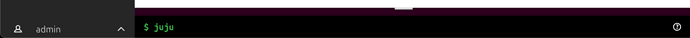
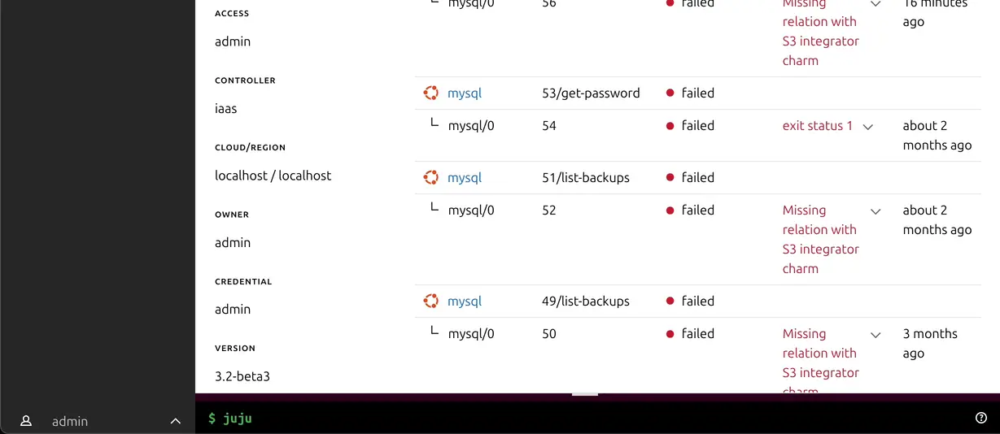
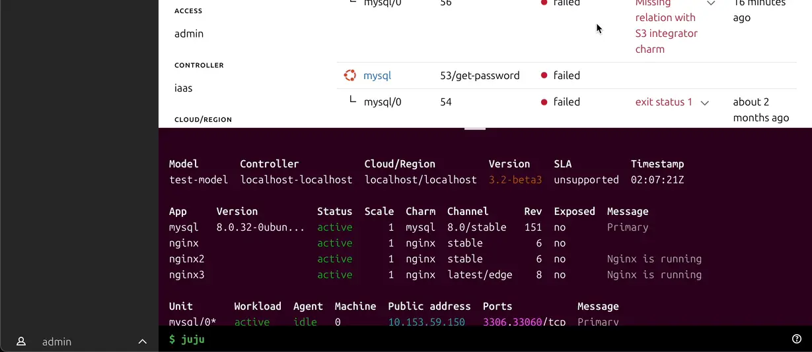

(juju-web-cli)=
# `juju` web CLI

The Juju web CLI gives you access to model level Juju CLI commands from within the Juju Dashboard when viewing a model’s detail page.

> This feature is only available in Juju 2.9 and above.

When viewing the model details page, along the bottom you’ll see an input where you can enter Juju CLI commands:

You can view a list of the available commands by running `help commands` in this prompt.

As this prompt only allows you to execute a subset of the Juju CLI you do not need to prefix your command with `juju`.

> This feature respects all the same ACL levels as your local Juju CLI and as such you won’t be able to perform any actions here you wouldn’t be able to perform elsewhere.

The output of your commands will be shown in a height adjustable panel that will open above the input. This output will be cleared with every new command entered.

## Features

To resize the output click and drag the top of the output element to the desired size.

The link to these docs can be found by clicking the help icon to the right of the input.

