(juju-architecture)=
# Juju architecture


(bootstrapping)=
## Bootstrapping

In Juju, **bootstrapping** refers to the process whereby a Juju client creates a {ref}`controller <controller>` on a specific {ref}`cloud <cloud>`.

A controller is needed to perform any further Juju operations, such as deploying an application.

(bootstrapping-on-a-kubernetes-cloud)=
### Bootstrapping on a Kubernetes cloud


#### The process

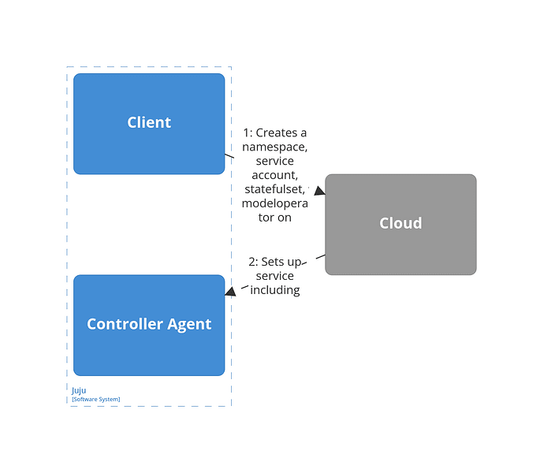
<br> *Bootstrapping a controller on a Kubernetes cloud: The process.*<br>


#### The result

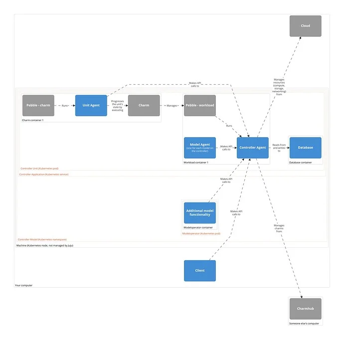
<br> *Bootstrapping a controller on a Kubernetes cloud: The result.*<br>

(bootstrapping-on-a-machine-cloud)=
### Bootstrapping on a machine cloud

#### The process

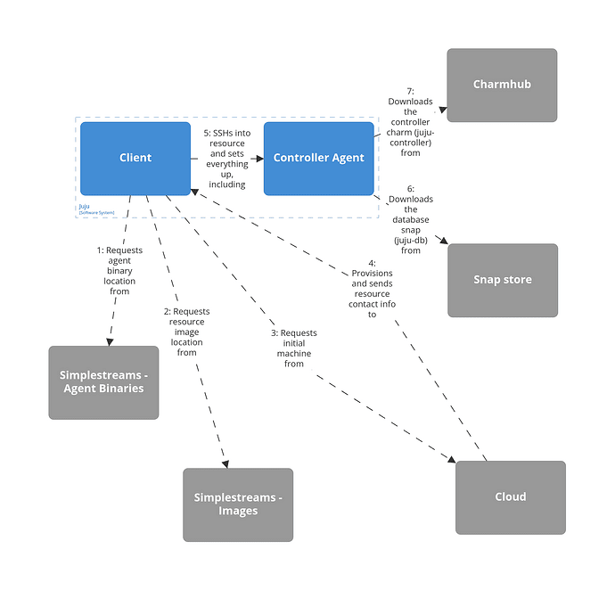
<br> *Bootstrapping a controller on a machine cloud: The process.*<br>

> See more: [Source code](https://github.com/juju/juju/blob/3.4/cmd/jujud/agent/bootstrap.go), {ref}`bootstrap-a-controller`

#### The result

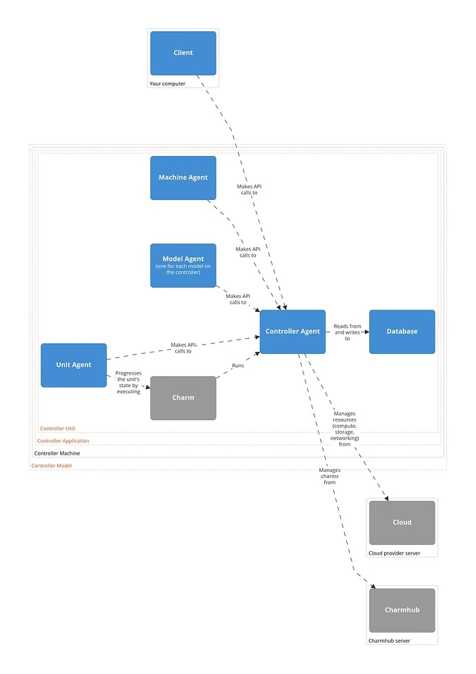

<br> *Bootstrapping a controller on a machine cloud: The result. (Note: The machine, model, unit, and controller agent are actually all part of the same {ref}`jujud <jujud>` process and refer in fact to trees of workers with machine, model, unit and, respectively, controller responsibility.)*<br>


(deploying)=
## Deploying

In Juju, **deploying** refers to the process where Juju uses a {ref}`charm <charm>` (from Charmhub or a local path) to install an {ref}`application <application>` on a resource from a {ref}`cloud <cloud>`.

(deploying-on-a-kubernetes-cloud)=
### Deploying on a Kubernetes cloud

#### The process

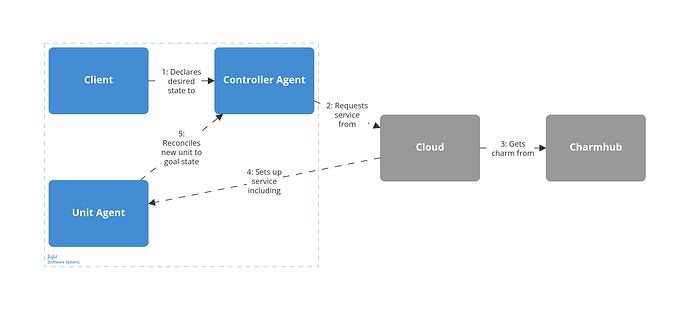

#### The result

Note: This diagram assumes a typical scenario with a single workload container (depending on the charm, there may be more and there may be none).

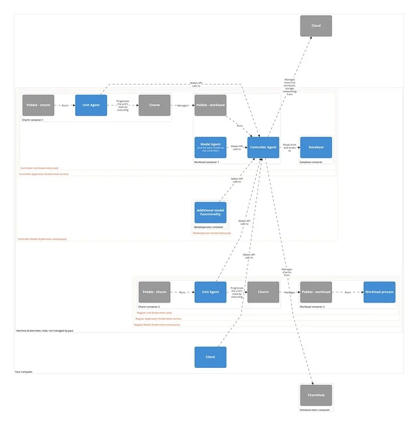

(deploying-on-a-machine-cloud)=
### Deploying on a machine cloud

#### The process

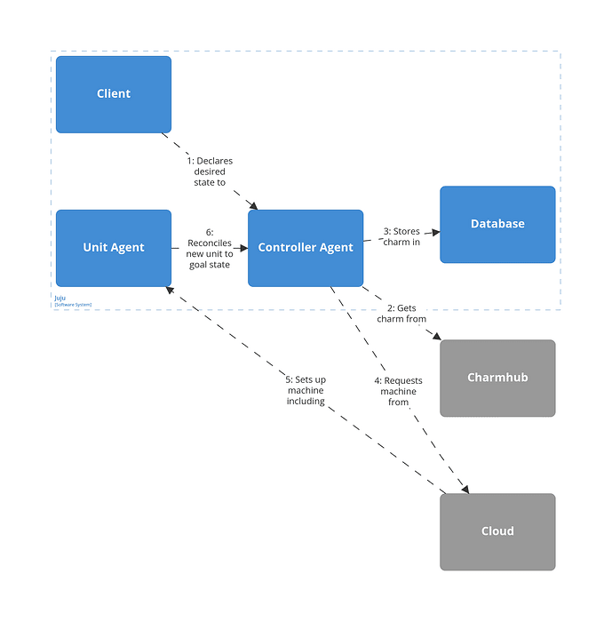

#### The result

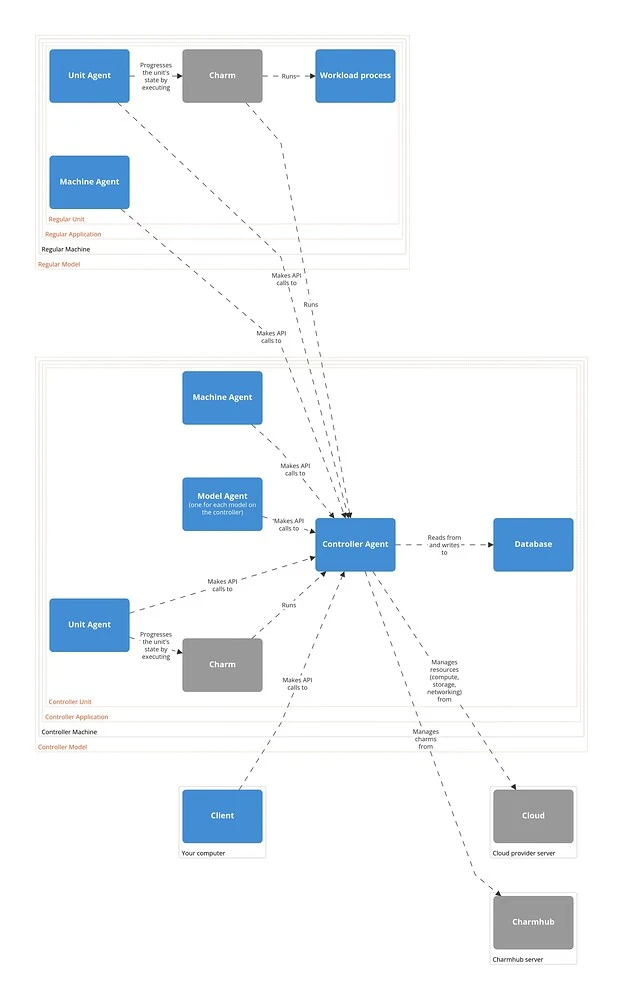

<br> *Deploying an application on a machine cloud: The result. This diagram assumes a typical scenario where the unit is deployed on a new machine of its own. (Note: The machine, model, unit, and controller agent are actually all part of the same {ref}`jujud <jujud>` process and refer in fact to trees of workers with machine, model, unit and, respectively, controller responsibility.)*

```{important}

**If you're curious about deployments to a *system container* on a VM:**

On most machine clouds, Juju makes it possible to deploy to a system container *inside* the machine rather to the machine directly. The result doesn't change much: In terms of the diagram above, the only difference would be another box in between the "Regular Model Machine" and its contents and another machine agent for this box, as Juju treats system containers as regular machines.

> See more: {ref}`machine`Machine > Machines and system (LXD) containers <11285m>`

```


(the-juju-execution-flow-for-a-charm)=
## The Juju execution flow for a charm

The Juju {ref}`controller <controller>` fires {ref}`hooks <hook>` at the {ref}`unit agent <unit-agent>` that is in the charm container / machine. The unit agent executes the charm according to certain {ref}`charm environment variables <hook>`. For a charm written with Ops (the current standard), Ops translates these environment variables into events, and these events are observed and handled in the charm code. All of this is represented schematically in the diagram below, where the top depicts the situation for a Kubernetes charm and the bottom -- for a machine charm.

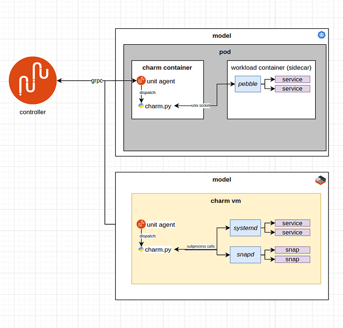

For more detail, keep reading.

(talking-to-a-workload-control-flow-from-a-to-z)=
### Talking to a workload: control flow from A to Z

(Excerpt from a presentation given at a Community Workshop on Friday 8 April 2022)

Suppose you have a workload; a database, a webserver, a microservice... And then you write a charm to manage your workload. Then you go on and deploy it in some model in some cloud on which you bootstrapped a juju controller.

What is the 10.000ft view of what's going on when you, the cloud admin, want to talk to your workload?

```{note}

'talking' here loosely means: running an action on the charm, or doing things on your deployment by means of the juju cli, such as: scaling up/down, etc...
In practice, anything that will cause the charm to execute.

```

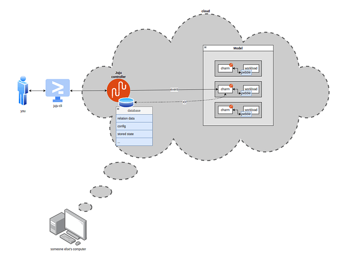

First a clarification of what the juju model (model for short) is; and what its relationship with the controller is.
The controller is a persistent process that runs in the cloud and manages communication between you and the cloud (via juju client commands) and handles application deployment and monitoring.
The controller also has access to a database storing all sorts of things (we'll get back to this later), among which a data structure which we'll call **the model**; representing the current state of the world so far as juju is concerned.
As a toy example, let's take two applications, A and B. The cloud admin deployed 2 units of A and 1 unit of B, and related them over R.

The model contains information such as:
   - There is an application called A, with two units
   - There is an application called B, with one unit
   - A is related to B by relation R
   - B has configuration {x:y, z:w, ...}
   - And so on and so forth...

```{note}

A *unit* is a single copy or instance of a (charmed) application running on the cloud substrate (e.g. a kubernetes pod, lxd container, etc.).

```

The flow of you talking to a workload typically goes as follows:

1. You, the cloud admin, types a juju cli command on a terminal.
2. The juju cli parses your command and sends a request to the juju controller API.
3. The juju controller interprets your command and:
  - makes changes to the model according to what your command prescribes; e.g. if you typed `juju add-unit A -n 2`, it updates the internal model to increase the number of units for the application `A` by two;
  - makes changes to the cloud substrate to match what the model says. E.g. it is going to spin up two more pods and deploy charm A on them.
4. The juju agents running on the charm containers constantly monitor the model in the controller for changes (in parallel). They compare their local state with the 'master state' held by the controller and, as soon as something changes, they update their local state and sort through the diff, figuring out what the next most important change is, until there are no changes left. For example, A replicas will be informed that there are new peers coming up, and if A touches its R databag when coming up, B will be informed that changes to the relation data have occurred...
Therefore the juju agent will only be dispatching an event at a time, dispatching the next only when the previous one has 'returned'. To dispatch an event means, at this stage, to execute the charm pod (the charm container inside the charm pod) with a bunch of env variables which will tell the pod which type of event is being triggered and other relevant metadata (thus, to be clear, multiple units *could* be dispatching in parallel).
6. What it means in practice to dispatch an event: the juju agent in the charm pod assembles a set of environment variables (the **environment**) and executes the charm with it. The charm code is executed by a shell script called `dispatch`, located in the charm folder on the unit. The environment includes information such as: the address of the unit, the name of the unit, the name of the event currently being dispatched (i.e. "why I woke you up"), and more...
7. The charm executes, aka: `main(YourCharmBaseSubclass)`...
8. The charm operates the workload in whatever way appropriate to the event being handled; if necessary, it will interact with the live workload through `pebble`, to read/write the workload filesystem, run commands, etc...

It is important to understand the role of the controller in managing the **state** of a charm. When the juju agent is awakened and the charm executed, there is nothing persisted from the previous run, except for whatever is stored in the controller database.

What, then, is stored in the controller database?
* **Relation data**: a key-value mapping that can be read-written by charms according to strict access-control rules (that depend on leadership, on which application the charm belongs to, etc...). It's important to realize that for two charms, to be related *MEANS* to have a dedicated relation data entry in the controller's database which can be read and written to. There is nothing more to it than relations. Charm A is related to charm B if and only if it can read/write specific sections of that database.
* Charm **config**: a key-value mapping that can be read and written to by the juju cli, and is read-only for charms. `CharmBase.config` is the API the `ops` library offers to read from it.
* **Unit/application status**: what the public status of the local unit and application are (and the associated message).
* A charm's **stored state**; i.e. a key-value mapping. `StoredState` is the API offered by the `ops` library to read/write this storage at runtime, and that is pretty much the only reliable persistence layer charms 'natively' offer at present. 'Non-native' solutions to persisting charm state could include integrating with another charm or service providing an independent database.
* **Leadership status**: which unit is leader.

So the charm, at runtime, can read/write some data from the controller database (through {ref}`hook command <hook-command>` calls) and thereby access some configuration parameters to decide which codepath to execute and how to manage its workload.

This is all there is to it!

## Synchronization

A final note on synchronization: the charm (or rather the unit agent on its behalf) and the controller exchange information. For example the charm could get the relation data contents, or set the unit status.
**When** is this data exchanged, at which point in the charm's runtime?

|Data|lazily fetched|input cached|output buffered|guaranteed true|
|---|---|---|---|---|
||||||
|relation data|yes|yes|yes|hook duration|
|secrets|yes|yes|yes|hook duration|
|config|no|yes|-|hook duration|
|leadership|yes|no|-|~30s|
|container connectivity|yes|no|-|0s|
|unit/app status|yes|yes|no|0s|
|stored state (local)|no|yes|yes|0s|
|stored state (controller)|yes|no|yes|0s|
|action results|-|-|yes|-|

- Leadership is an atomic check - therefore the value of `is_leader()` is fetched synchronously anytime it is requested, and is never cached. This is read-only.
- Container connectivity (`Container.can_connect()`) is also an atomic read-only check, same as leadership.  However, this data is in fact not persisted in the controller database (it's not sent to the controller at all!). Whether the container can connect is an instant check that attempts to ping the pebble server. The response is for the charm only, juju is completely unaware of the container's connectivity status.
- Config is loaded once on charm instantiation. This is read-only.
- Relation data is lazily loaded when first read, then cached for later use. Writes are also cached and synchronized only once if and when the charm exits without exceptions.
- Unit and application status are lazily loaded whenever the charm needs to access them, and whenever written, they are synced immediately with juju. This means that a single event handler could set status multiple times and thereby show the 'progress' of the hook to the cloud admin or some sort of real-time trace info.
- Stored state can follow one of two paths, depending on whether it is backed by controller storage, or it is locally stored in the unit. I.e. if `ops.main.main` is invoked with `use_controller_storage=True` or `False` (the default).
  -  **controller-backed** stored state is lazy-loaded when requested, buffered by the unit agent, and only synced with the controller when the charm process exits (and only if the exit code is 0! Otherwise, all changes are never synced and the state is effectively as if they never happened [[source](https://discourse.charmhub.io/t/keeping-state-in-juju-controllers-in-operator-framework/3303)]).
  - Locally-backed stored state is synchronously read and written to, the connection to the database is created at charm startup and closed on exit.

```{note}

This has some subtle but footgun-prone consequences that should be kept in mind:
controller-backed stored state is never synced (committed) if the charm exits nonzero:
so if you `set-state foo=bar` and then the charm errors out, that change will only be persisted if you are using local storage. if you `use_juju_for_storage`, that change will never be committed: it will be as if it had never happened.

```

A charm's runtime cycle can be split in three steps:
1) setup (initialize the charm, load some required data)
2) run all registered observers one by one (the ones the charm registered in its `__init__`, and before that, all the deferred ones from the previous run)
3) commit (push all buffered changes to the controller)

```{note}
 Do note that step 3 only occurs if the charm ran without raising exceptions; i.e. if `dispatch` returned 0. Otherwise the unit agent will not push any data to the controller. This implies that state changes that are *not* buffered, such as unit and app status, will be committed even if the charm exits nonzero, because they are committed synchronously before the exit code is known.
```

A representation of when the data is synced throughout a charm's runtime:
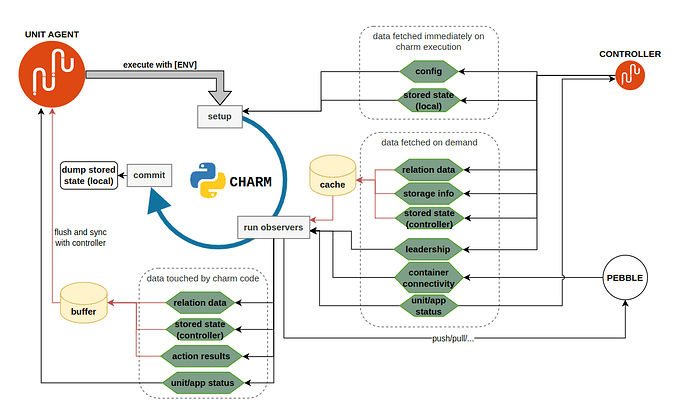
