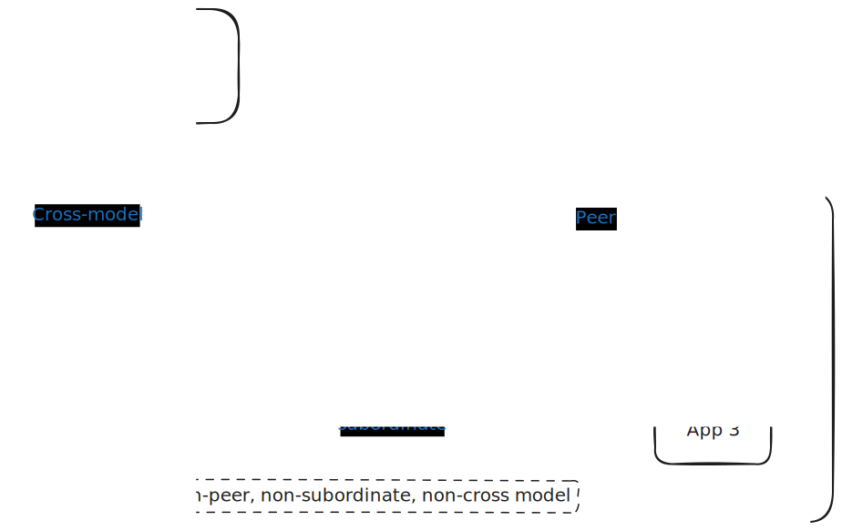

(relation)=
# Relation (integration)

> See also: {ref}`manage-relations`

In Juju, a **relation** (**integration**) is a connection an {ref}`application <application>` supports by virtue of having a particular {ref}`endpoint <application-endpoint>`.


<!--
Most applications rely on other applications to function correctly. For example, typically web apps require a database to connect to. Relations avoid the need for manual intervention when the charm’s environment changes. The charm will be notified of new changes, re-configure and restart the application automatically.

Relations are a Juju abstraction that enables applications to inter-operate. They are a communication channel between charmed operators.

A certain charm knows that it requires, say, a database and, correspondingly, a database charm knows that it is capable of satisfying another charm’s requirements. The act of joining such mutually-dependent charmed operators causes code (*hooks*) to run in each charm in such a way that both charmed operators can effectively talk to one another. When charmed operators have joined logically in this manner they are said to have formed a *relation*.
-->

## Relation taxonomy



(non-peer-relation)=
### Non-peer

A **non-peer** relation is a relation from one application to another, where the applications support the same endpoint interface and have opposite `provides` / `requires` endpoint roles.

<!--

<br> *Example non-peer relation: The WordPress application with actual relations to MySQL and Apache and a potential relation to HAProxy, by virtue of the `wordpress` charm having a [`requires` endpoint that supports the `mysql` interface](https://charmhub.io/wordpress/integrations#db), compatible with `mysql`'s [`provides` endpoint supporting the same interface](https://charmhub.io/mysql/integrations#mysql), and a [`provides` endpoint that supports the `http` interface](https://charmhub.io/wordpress/integrations#website), compatible with `apache2`'s or `haproxy`'s `requires` endpoint supporting the same interface, among others.* 
-->

(non-subordinate-relation)=
#### Non-subordinate

A **non-subordinate** relation (aka 'regular') is a {ref}`non-peer-relation` relation where the applications are both principal. 

##### Non-cross-model

A **non-cross-model** relation is a {ref}`non-subordinate <non-subordinate-relation>` relation where the applications are on  the same model.


(cross-model-relation)=
##### Cross-model
> See also: {ref}`manage-relations`


A **cross-model** relation (aka 'CMR') is a {ref}`non-subordinate <non-subordinate-relation>` relation where the applications are on different models (+/- different controllers, +/- different clouds).

Cross-model relations enable, for example, scenarios where  your databases are hosted on bare metal, to take advantage of I/O performance, and your applications live within Kubernetes, to take advantage of scalability and application density.

If the network topology is anything other than flat, the Juju controllers will need to be bootstrapped with `--controller-external-ips`, `--controller-external-name`, or both, so that the controllers are able to communicate. Note that these config values can only be set at bootstrap time, and are read-only thereafter.

A cross-model relation has two sides: the [offer](https://discourse.charmhub.io/t/how-to-manage-offers/1150) side (aka "offerer") and the consume side (aka saas). It does not make a difference which side of the relation (provider or requirer) is the offerer and which is the saas - the two are interchangeable. However, the endpoint type does influence on how juju sets up firewall rules: it is assumed that a requirer is the client and the provider is the server, so ports are opened on the provider side.

Note that application names are obfuscated (anonymised) to the offerer side:
- Applications that relate to the saas appear to the offerer as remote + token, e.g. `remote-76cd96ab50f146b284912afd1cc13a0e`.
- For the consumer, the remote app names is the saas name, e.g. `prometheus`.

(subordinate-relation)=
#### Subordinate

A **subordinate** relation is a {ref}`non-peer <non-peer-relation>` relation where one application is principal and the other subordinate.

A subordinate charm is by definition a charm deployed on the same machine as the principal charm it is intended to accompany. When you deploy a subordinate charm, it appears in your Juju model as an application with no unit. The subordinate relation helps the subordinate application acquire a unit. The subordinate application then scales automatically when the principal application does, by virtue of this relation.

(peer-relation)=
### Peer

A **peer** relation is a relation that an application has to itself (i.e., its units respond to one another) automatically by virtue of having a `peers` endpoint. 

Because every relation results in the creation of unit and application databags in Juju's database, peer relations are sometimes used by charm authors as a way to persist charm data. When the application has multiple units, peer relations are also the mechanism behind {ref}`high availability <high-availability>`.

<!--

CMR addresses the case where one may wish to centralise a service. This allows your models to become more targeted and can reduce the cloud resources they may require.  A common use case is to deploy [prometheus](https://charmhub.io/prometheus2) monitoring in a single, central model, and relate it to various data sources in other models hosting various workloads.

Some services that can benefit from central administration:

- Certificate Authorities, such as the `easyrsa` charm
- secret management, such as Vault
- logging and monitoring
- block storage management
- databases

Another use case would be when you are simply using different cloud types and wish to integrate the management of services across those different clouds.
-->

## Relation identification

A relation is identified by a **relation ID** (assigned automatically by Juju; expressed in monotonically increasing numbers) or a **relation key** (derived from the endpoints, format: `application1:[endpoint] application2:[endpoint]`).

## Permissions around relation databags

<!--The primary means for applications to communicate over a relation is using relation data.-->


When an application becomes involved in a relation, each one of its units gets a databag in the Juju database, as follows:

- each unit gets a **unit databag**
- each application gets an **application databag**

While the relation is maintained, 

- in a non-peer relation, whether regular or subordinate: 
    - each unit can read and write to its own databag;
    - leader units can also read and write to the local application databag;
    - all units of an application can read all of the remote application's databags.
- in a peer relation:
    - each unit can read and write to its own databag;
    - leader units can also read and write to the application databag;
    - all units can read all of the application's databags. That is, whether leader or not, every unit can read its own unit databag as well as every other unit's unit databag as well as the application databag.

```{important}

Note that, in peer relations, all permissions related to the remote application are turned inwards and become permissions related to the local application. 

```

## Relation lifecycle


When an application becomes involved in a relation, each one of its units gets an  `<endpoint>-relation-created` hook, then an `<endpoint name>-relation-joined` hook.

From the moment the relation is created, any unit involved in it can interact with it.
In practice, that means using one of the following hook tools that the Juju unit agent exposes to the charm:
- `relation-ids` 
- `relation-list`
- `relation-get`
- `relation-set`

When the charm uses `relation-set` to write something to a databag, all of the units that have read access to that same databag will be notified by means of a `<endpoint name>-relation-changed` hook.

For example, if the `wordpress/0*` leader uses `relation-set` to write to its local *unit* databag, its peers and the `mysql/0*` leader will receive `http-relation-changed`, because they can access that data (by calling `relation-get`), but the other mysql units will not be notified.

Any time one of the involved applications is scaled up, the existing units will receive `<endpoint>-relation-joined`, once for each unit being added. 
Any time one of the involved applications is scaled down, the existing units will receive `<endpoint>-relation-departed`, once for each unit being removed.

When the user destroys the relation by using `juju remove-relation`, all involved units will be notified with `<endpoint>-relation-broken`. 

<!--From https://discourse.charmhub.io/t/the-lifecycle-of-charm-integrations/1050 -->

A unit's `scope` consists of the group of units that are transitively connected to that unit within a particular integration. So, for a globally-scoped integration, that means every unit of each service in the integration; for a container-scoped integration, it means only those sets of units which are deployed alongside one another. That is to say: a globally-scoped integration has a single unit scope, whilst a container-scoped integration has one for each principal unit.

When a unit becomes aware that it is a member of an integration, its only self-directed action is to `join` its scope within that integration. This involves two steps:

-   Write initial integration settings (just one value, `private-address`), to ensure that they will be available to observers before they're triggered by the next step;
-   Signal its existence, and role in the integration, to the rest of the system.

The unit then starts observing and reacting to any other units in its scope which are playing a role in which it is interested. To be specific:

-   Each provider unit observes every requirer unit
-   Each requirer unit observes every provider unit
-   Each peer unit observes every other peer unit

Now, suppose that some unit as the very first unit to join the relation; and let's say it's a requirer. No provider units are present, so no hooks will fire. But, when a provider unit joins the relation, the requirer and provider become aware of each other almost simultaneously. (Similarly, the first two units in a peer integration become aware of each other almost simultaneously.)

So, concurrently, the units on each side of the integration run their relation- joined and relation-changed hooks with respect to their counterpart. The intent is that they communicate appropriate information to each other to set up some sort of connection, by using the relation-set and relation-get hook tools; but neither unit is safe to assume that any particular setting has yet been set by its counterpart.

This sounds tricky to deal with, but merely requires suitable respect for the relation-get tool: it is important to realise that relation-get is never *guaranteed* to contain any values at all, because we have decided that it's perfectly legitimate for a unit to delete its own private-address value. But in normal circumstances, it's reasonable to treat `private-address` as guaranteed.

In one specific kind of hook, this is easy to deal with. A relation-changed hook can always exit without error when the current remote unit is missing data, because the hook is guaranteed to be run again when that data changes: assuming the remote unit is running a charm that agrees on how to implement the interface, the data *will* change and the hook *will* be run again.

In *all* other cases - unit hooks, relation hooks for a different relation, relation hooks for a different remote unit in the same relation, and even relation hooks other than -changed for the *same* remote unit - there is no such guarantee. These hooks all run on their own schedule, and there is no reason to expect them to be re-run on a predictable schedule, or in some cases ever again.

This means that all such hooks need to be able to handle missing integration data, and to complete successfully; they mustn't fail, because the user is powerless to resolve the situation, and they can't even wait for state to change, because they all see their own sandboxed composite snapshot of fairly-recent state, which never changes.

So, outside a very narrow range of circumstances, relation-get should be treated with particular care. The corresponding advice for relation-set is very simple by comparison: relation-set should be called early and often. Because the unit agent serializes hook execution, there is never any danger of concurrent changes to the data, and so a null setting change can be safely ignored, and will not cause other units to react.

## Departing relations

A unit will depart a relation when either the relation or the unit itself is marked for termination. In either case, it follows the same sequence:

-   For every known related unit (those which have joined and not yet departed), run the relation-departed hook.
-   Run the relation-broken hook.
-   `depart` from its scope in the relation.

So what's the difference between relation-departed and relation-broken? Think of relation-departed as the "saying goodbye" event. While in the latter state, relation settings can still be read (with relation-get) and a relation can even still be set (with relation-set). Once relation-broken fires, however, the relation no longer exists. This is a good spot to do any final cleanup, if necessary. Both relation-departed and relation-broken will always fire, regardless of how the relation is terminated.

The unit's eventual departure from its scope will in turn be detected by units of the related service (if they have not already inferred its imminent departure by other means) and cause them to run relation-departed hooks. A unit's integration settings persist beyond its own departure from the integration; the final unit to depart an integration marked for termination is responsible for destroying the relation and all associated data.
