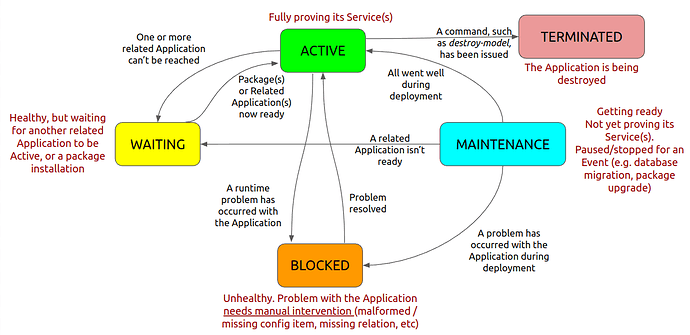

(status)=
# Status

In Juju, **status** can describe the status of an application or a unit, where the former can be inferred from the latter and the latter consists of the workload and the Juju agent status. This document gives more information about all of these different kinds of status -- their values and their meanings.

## Types of status

### Application status

As its name indicates, the application status reports on the status of each deployed application. 

The application status can be specified by the charm author. When not specified, it is the highest-priority status of the workload statuses of all of the application's units. So if all workloads are active, the application will also be active, but if even  just one workload is blocked, the application will also be marked blocked. 


The following figure provides an illustration of the status an application may be in at a given time, and lists the reasons for the transitions between different statuses:

 

### Unit status

The unit status is given by the status of its workload/charm and the status of its `juju` agent. 

```{note}
A unit's status is usually expressed as `<workload status>/<agent status>`, e.g. , `active/idle` or `unknown/lost`.
```

#### Workload / charm status

<!--
For the priority order, see: https://github.com/juju/juju/blob/bcca5675c4ffec94f477959e5c967a913dc7e86c/core/status/status.go#L373 
-->

The workload / charm status reports the status of the charm(ed service):

```{caution}

Except for `error`, `terminated` and `unknown`, which are set by Juju, the workload status is generally speaking set by the charm.  As such, its semantics is ultimately up to the charm author. The meanings listed below represent just the ideal case, if the charm author has followed the best practice guidelines. 

```


| Status | Meaning |
|--|--|
| `error`| The unit is in error, likely from a hook failure. |
| `blocked` | The charm is stuck. Human intervention is required. |
| `maintenance` | The charm is performing some (long-running) task such as installing a package or restarting a service. No human intervention is required.|
| `waiting` | The charm is waiting for another charm it's integrated with to be ready. No human intervention required. |
| `active` | The charm is alive and well. Everything's fine. |
| `unknown` | The charm status is unknown. It may be still setting up, or something might have gone wrong. |
| `terminated` | The workload is being destroyed, e.g. as a consequence of `juju destroy-model`. |


#### Agent status


<!--COMMENT: I THINK THE EXPLANATION BETWEEN BRACKETS IS NOT CLEAR HERE, SO BETTER TO LEAVE OUT.
The agent status reports the status of the `juju` agent running in the unit as it interacts with the **juju controller** (as a consequence of scheduled lifecycle events or the operator interacting with it, in turn, via the juju CLI).
-->

The agent status reports the status of the `juju` agent running in the unit as it interacts with the `juju` controller:

| Status | Meaning|
|--|--|
|`allocating` | The charm pod has not come up yet. |
| `idle` | The `juju` agent in the charm container is not doing anything at the moment, and waiting for events. |
| `executing` | The `juju` agent in the charm container is executing some task. |
| `error` | The `juju` agent in the charm container has run but has encountered an uncaught charm exception. |
| `lost` | The `juju` agent is unresponsive, or its pod/container has unexpectedly come down. |

The agent status is determined and set by the `juju` agent, so it cannot be directly controlled by the charm or a human operator.


```{note}

Each newly deployed unit starts in `maintenance/allocating`, quickly going to `maintenance/executing` as the setup phase hooks are executed. If, by the time the install hook (if any) returns, the charm has set no workload status, the unit will go to `unknown/idle`. So, in principle, at the end of the install event handler it should be clear if all went well (in which case the user should set active) or not.

```


<!-- COMMENT: THIS DOC REFERENCES THE GUI, WHICH IS NO LONGER AVAILABLE, AND ALSO CONFLATES WORKLOAD AND UNIT/AGENT STATUSES. REPLACING IT WITH MATERIAL PREPARED BASED ON NOTES FROM FEB-MAR 2022 SPRINT BY PIETRO PASOTTI.

<div data-theme-toc="true"> </div>

A unit can report its status as one of the following:

|Status|Colour in GUI|Meaning|
|--- |--- |--- |
|blocked|blue|This unit needs manual intervention because of a problem associated directly with the unit itself. This may be due to bad or inconsistent configuration of the application, disk space being unavailable for the unit, or missing relations which are essential to the application's operations. The message should tell a human administrator what is required to unblock the application. For example: "Please provide an object store", "Please configure the minimum speed required by users of this application", "Please link this application to a database", etc. |
|maintenance|yellow|The unit is not yet providing services, but is actively doing stuff in preparation for providing those services. This is a “spinning” state, not an error state. It reflects activity on the unit itself, not on peers or related units. The Juju agent will set the unit to maintenance when it begins the process of installing the charm - downloading it, unpacking it and calling the install hook.The unit may transition to the maintenance state at any time, in any hook. The maintenance state implies that the unit has no reason to think that it will not provide service soon. For example, the software might be formatting block devices, or replicating data from peer units, or handling an action which for whatever reason means that it is not active, but it is not aware of anything on its own config or in related unit config that will prevent it from bringing up its application.Counterparts to this unit should expect that calls to this unit will fail during the period it is in the maintenance state, but unless they have an urgent need to move to another counterpart, they should just wait for this unit to finish churning. Being in maintenance does not require human intervention.|
|waiting|yellow|The unit is unable to progress to an active state because an application to which it is related is not running. That application might be in error, blocked, waiting or maintenance. This unit expects it will be able to proceed towards active as soon as the things it is concerned about are resolved there - it needs no human attention (otherwise its status would be blocked).|
|active|green|This unit believes it is correctly offering all the services it is primarily installed to provide. An application can be active even if additional relations are being configured and set up. For example, a Ceph OSD application that is connected to its monitors is active, even if you then relate it to Nagios; setting up a subordinate does not impinge on the OSD functionality which is its primary purpose for existing.|

Additional values may be seen for a unit which have been set by Juju rather than the charm, under the circumstances explained below:

|Status|Colour in GUI|Meaning|
|--- |--- |--- |
|error|red|A charm hook for this unit has exited with a non-zero exit code (crashed). No further hooks will be called or messages delivered until this is resolved; manually resolving or manually asking for the hook to be run, successfully, addresses the issue and resets the state to "unknown" with a message of "Error resolved with no further status from charm".|
|unknown|yellow|A unit-agent has finished calling install, config-changed, and start, but the charm has not called status-set yet. Rather than guess as to whether the application is working, Juju will set its status to "unknown". A unit is also marked as “unknown” when the unit agent fails for some reason eg loss of connectivity.|
|terminated|none, CLI-only|This unit used to exist, we have a record of it (perhaps because of storage allocated for it that was flagged to survive it). Nonetheless, it is now gone.|

```{note}

The `Colour in GUI` is included for information at this point, until this feature is fully supported in the Juju GUI.

```

-->

## Status in the output of `juju status`

In the output of `juju status`, application status is given under `App{ref}`lication] > Status` and unit status -- consisting, as we said, of the workload / charm status and of the Juju agent status -- is given under `Unit > Workload, Agent`. 


````{dropdown} Expand to view a sample 'juju status' output

```text
Model        Controller           Cloud/Region        Version  SLA          Timestamp
charm-model  tutorial-controller  microk8s/localhost  3.1.5    unsupported  14:23:55+02:00

App             Version  Status  Scale  Charm           Channel    Rev  Address         Exposed  Message
demo-api-charm  1.0.0    active      1  demo-api-charm               0  10.152.183.175  no       
postgresql-k8s  14.7     active      1  postgresql-k8s  14/stable   73  10.152.183.237  no       Primary

Unit               Workload  Agent  Address      Ports  Message
demo-api-charm/0*  active    idle   10.1.157.72         
postgresql-k8s/0*  active    idle   10.1.157.74         Primary
```

````


> See more: `command-juju-status`
