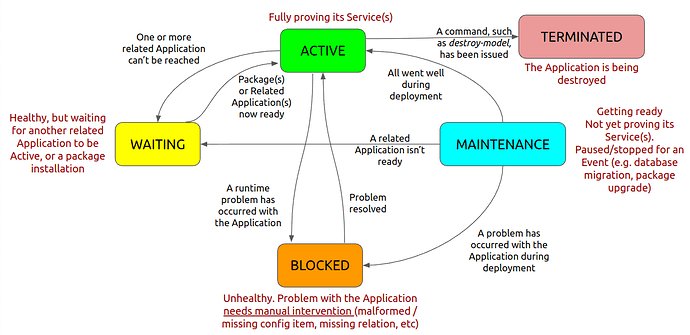

---
myst:
  html_meta:
    description: "Juju status reference: application and unit status values, workload status, agent status, and status transition diagrams."
---

(status)=
# Status

In Juju, **status** can describe the status of an application or a unit, where the former can be inferred from the latter and the latter consists of the workload and the Juju agent status. This document gives more information about all of these different kinds of status -- their values and their meanings.

## Types of status

(application-status)=
### Application status

As its name indicates, the application status reports on the status of each deployed application.

The application status can be specified by the charm author. When not specified, it is the highest-priority status of the workload statuses of all of the application's units. So if all workloads are active, the application will also be active, but if even  just one workload is blocked, the application will also be marked blocked.

The following figure provides an illustration of the status an application may be in at a given time, and lists the reasons for the transitions between different statuses:



(unit-status)=
### Unit status

The unit status is given by the status of its workload/charm and the status of its Juju agent.

```{note}
A unit's status is usually expressed as `<workload status>/<agent status>`, e.g. , `active/idle` or `unknown/lost`.
```

(workload--charm-status)=
#### Workload / charm status

The workload / charm status reports the status of the charm(ed service):

```{caution}

Except for `error`, `terminated` and `unknown`, which are set by Juju, the workload status is generally speaking set by the charm.  As such, its semantics is ultimately up to the charm author. The meanings listed below represent just the ideal case, if the charm author has followed the best practice guidelines.

```

| Status | Meaning |
|--|--|
| `error`| The unit is in error, likely from a hook failure. |
| `blocked` | The charm is stuck. Human intervention is required. |
| `maintenance` | The charm is performing some (long-running) task such as installing a package or restarting a service. No human intervention is required.|
| `waiting` | The charm is waiting for another charm it's integrated with to be ready. No human intervention required. |
| `active` | The charm is alive and well. Everything's fine. |
| `unknown` | The charm status is unknown. It may be still setting up, or something might have gone wrong. |
| `terminated` | The workload is being destroyed, e.g. as a consequence of `juju destroy-model`. |

#### Agent status

The agent status reports the status of the Juju agent running in the unit as it interacts with the `juju` controller:

| Status | Meaning|
|--|--|
|`allocating` | The charm pod has not come up yet. |
| `idle` | The Juju agent in the charm container is not doing anything at the moment, and waiting for events. |
| `executing` | The Juju agent in the charm container is executing some task. |
| `error` | The Juju agent in the charm container has run but has encountered an uncaught charm exception. |
| `lost` | The Juju agent is unresponsive, or its pod/container has unexpectedly come down. |

The agent status is determined and set by the Juju agent, so it cannot be directly controlled by the charm or a human operator.

```{note}

Each newly deployed unit starts in `maintenance/allocating`, quickly going to `maintenance/executing` as the setup phase hooks are executed. If, by the time the install hook (if any) returns, the charm has set no workload status, the unit will go to `unknown/idle`. So, in principle, at the end of the install event handler it should be clear if all went well (in which case the user should set active) or not.

```

## Status in the output of `juju status`

In the output of `juju status`, application status is given under `Application > Status` and unit status -- consisting, as we said, of the workload / charm status and of the Juju agent status -- is given under `Unit > Workload, Agent`.

````{dropdown} Expand to view a sample 'juju status' output

```text
Model        Controller           Cloud/Region        Version  SLA          Timestamp
charm-model  tutorial-controller  microk8s/localhost  3.1.5    unsupported  14:23:55+02:00

App             Version  Status  Scale  Charm           Channel    Rev  Address         Exposed  Message
demo-api-charm  1.0.0    active      1  demo-api-charm               0  10.152.183.175  no
postgresql-k8s  14.7     active      1  postgresql-k8s  14/stable   73  10.152.183.237  no       Primary

Unit               Workload  Agent  Address      Ports  Message
demo-api-charm/0*  active    idle   10.1.157.72
postgresql-k8s/0*  active    idle   10.1.157.74         Primary
```

````

```{ibnote}
See more: `command-juju-status`
```
