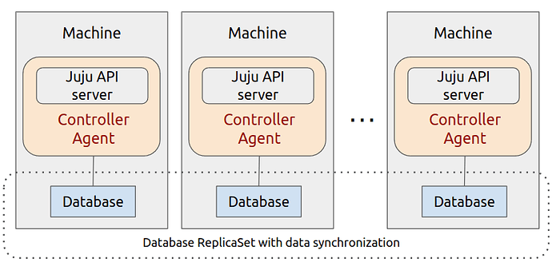

(high-availability)=
# High availability (HA)

 > See also: 
> - {ref}`make-a-controller-highly-available`
> - {ref}`make-an-application-highly-available`

In the context of a cloud deployment in general, **high availability (HA)** is the concept of making software resilient to failures by means of running multiple replicas with shared and synchronised software context -- something usually achieved through coordinated {ref}`scaling (horizontally and up) <scaling>`. In Juju, it is supported for controllers on machine clouds and for regular applications on both machine and Kubernetes clouds

***Controller high availability (machine clouds).** Juju controllers can be made highly-available by enabling more than one machine to each run a separate controller unit with a separate controller agent instance, where each machine effectively becomes an instance of the controller. This set of Juju agents collectively use a database replicaset to achieve data synchronisation amongst them.*
