(juju-dashboard)=
# `juju-dashboard` (The Juju dashboard)

> See also: [Charmhub | `juju-dashboard`](https://charmhub.io/juju-dashboard), {ref}`manage-the-juju-dashboard`

```{note}

Note: A small number of dashboard features (e.g. the web CLI) are dependent on the deployment environment. These are noted as “requirements” in this document.

```


The Juju Dashboard aims to expose Juju environments, providing at-scale management, status and collaboration features not found in the Juju CLI. It is intended to supplement the CLI experience with  aggregate views and at a glance health checks. In particular, it provides a quick way to view details for all the entities in your Juju environment (models, controllers, etc.), and in places also provides functionality related to the ongoing maintenance of your estate.

Juju Dashboard is hosted on [JAAS](https://jaas.ai/) for use with JAAS controllers, but can also be deployed on local controllers.

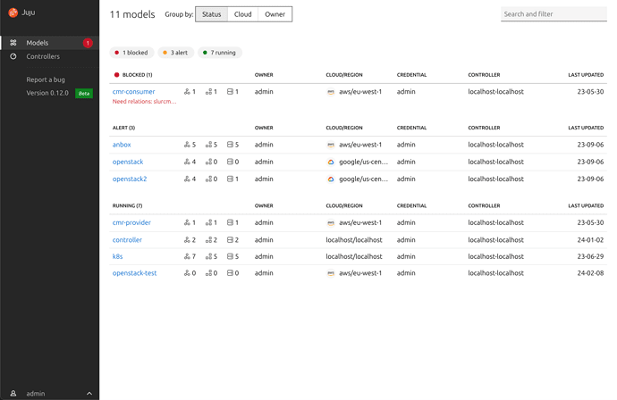

```{caution}

Prior to `juju v.3.0`,  the Juju dashboard was automatically deployed with every controller, but from `juju v.3.0` it needs to be set up by [deploying](https://juju.is/docs/juju/manage-the-juju-dashboard#heading--set-up-the-dashboard) the `juju-dashboard` or `juju-dashboard-k8s` charm in the controller model and integrating it with the `controller` application. 

```


## Models view

The models view lists all the models associated with the connected controllers that you have some form of access to. The list displays the models across clouds. This allows you to access the health of all the models at a glance, surfacing any relevant errors so you can quickly investigate what has happened.

### Group by

The list can be grouped by status, cloud, or owner. The default grouping is by status, which brings the models with errors to the top of the list.

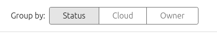

### Search and filtering

The dashboard provides comprehensive search and filter functionality. This allows you to perform complex filtering of the models list which can be shared via the URL.

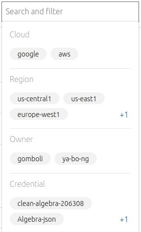


## Model details view


The purpose of the model details view is to provide a list of the applications running on that model. In this view you can also manage access to the model.

This view can be accessed by navigating to the model list (click “Models” in the side navigation) and then clicking on the title of a model in the list.

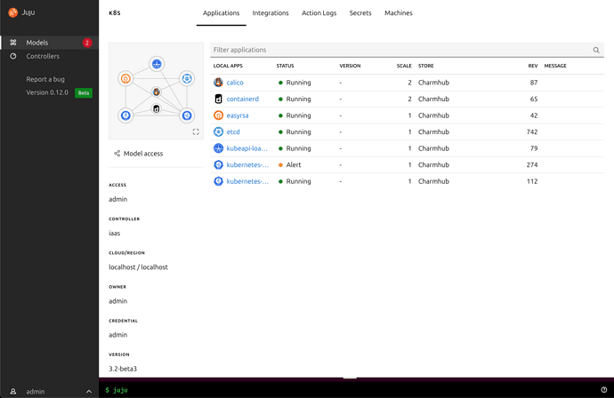

### Unit view

The unit view scopes your list of units to the model and application you are inspecting. This view will give fine-grained information about the status of each unit and information on this public availability.

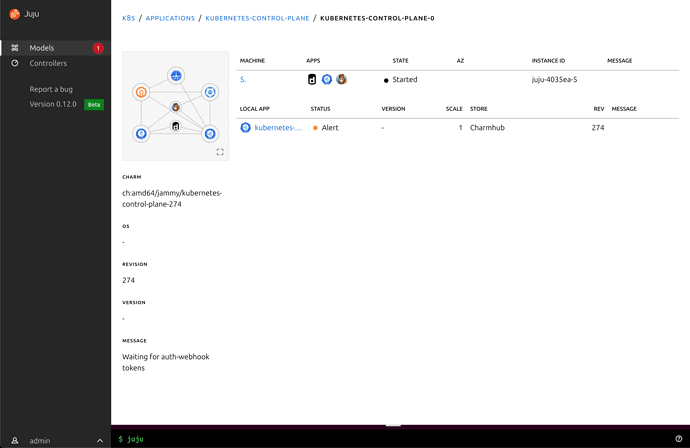

### Machine view

```{note}
Requirements: this view is only available for a [machine charm](https://juju.is/docs/sdk/charm-taxonomy#heading--charm-types-by-substrate) environment and will not be visible when deployed on Kubernetes.

```

The machine view displays all [machine instances](https://juju.is/docs/juju/machine) managed by Juju. It all also displays the machine status and any applications running on the machines.

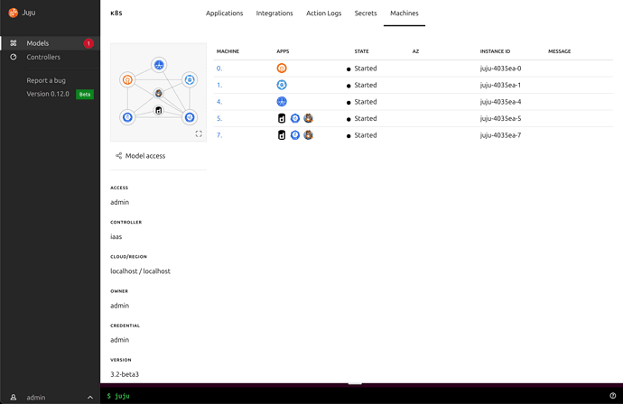

The machine details view displays all machine information for the selected machine. Machine details is accessible via an application deployed to a model. The machine details view shows a list of the units running on the machine and the applications associated with the units.

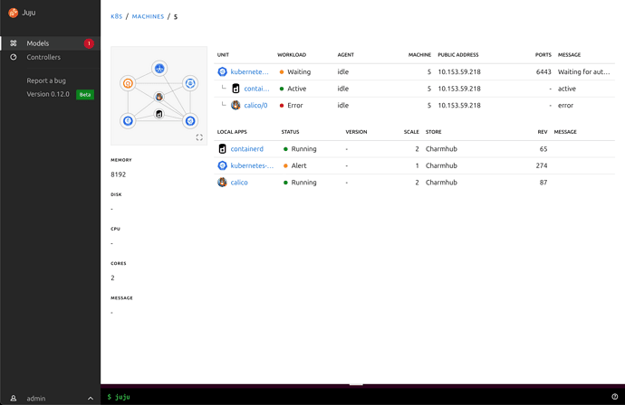


### Relations view


The integrations view (sometimes called relations) displays the information about each integration in a model. This view is accessible from the model details view as an option in the tabbed navigation at the top of the page.

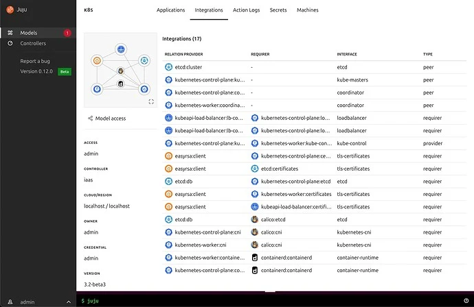

This view provides information about each integration and acts as an at a glance overview of the health of your models relations and a status to help you debug any issues.

### Configuring applications

Applications can be configured from the dashboard. Navigate to an application details page and click the 'Configure' button on the left hand side and you will be shown the configuration panel.

By clicking on a configuration option you can see the description for that option that has been provided by the charm maintainer.

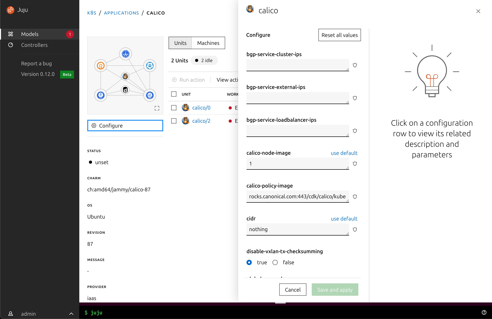

### Web CLI

```{note}

Requirements: the web CLI is only available when the dashboard is deployed on a local controller and is not available when using JAAS.

```

The dashboard provides a way to run Juju CLI commands from the web interface. For full details see the [web CLI docs](https://juju.is/docs/olm/the-juju-web-cli).

## Controllers view

The controllers view offers a top level view, monitoring across different controllers, and the possibility to add, edit, and manage controllers. It displays a set of aggregate charts to represent the status of the controllers that have been added to the dashboard. It also displays a table listing each controller and the usage of each entity hosted by the controller.

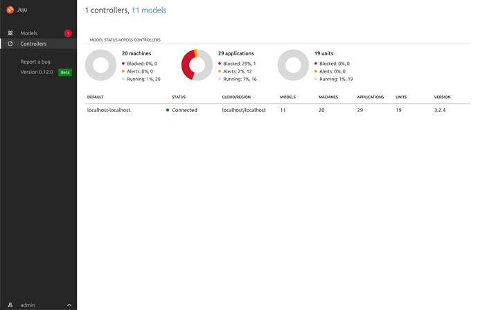

## Model access management

If you have admin rights on a model, the dashboard allows you to add, remove, or modify other users' access to the model. Once model access has been granted, the model will automatically appear in that user's model list.

The model access panel can be opened from a button that appears on hover in the [model list](https://juju.is/docs/juju/the-juju-dashboard#heading--models-view) for models you have admin access to and will also appear on the left side of the [model details](https://juju.is/docs/juju/the-juju-dashboard#heading--model-details-view) views.

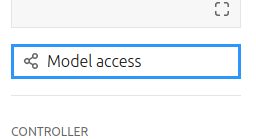

To add a user, enter the username of the person you want to grant access too. Then select the permission level you would like to grant. Finally, click the “Add user” button.

When using an external authentication provider the user domain will need to be included in the format `[username]@[domain]`.

JAAS uses the Ubuntu SSO provider and to allow access to other users you can use the format `[ubuntu-sso-username]@external`.

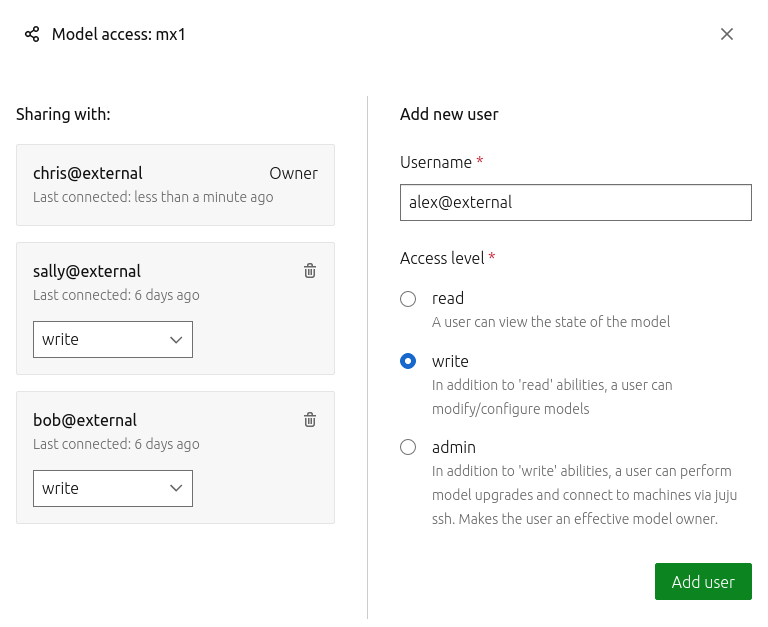

## Running actions from the dashboard
 

If you have write or admin permissions on a model, you can trigger any available action the charmed application provides. If the action requires options, the UI will provide these as a form with help text to describe the options and the default values.

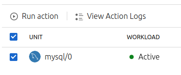

Actions are run on the unit level. To view and trigger actions, visit an application's unit view, select the units you would like the action to run on, and click the Run actions button. This will bring up a side panel with a list of available actions. Find and select the action you wish to run, provide any necessary options, and click "Run action".

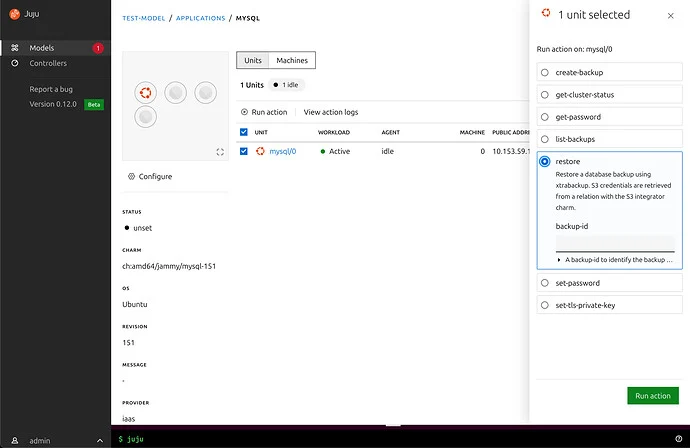

### Running actions on multiple applications

You can also run action on units of multiple applications of the same type at once. Navigate to the list of applications in a model and perform a search using the search input in the header.

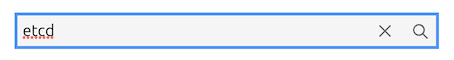

Tick the applications you want to perform actions on and click the 'Run action' button. If you've selected applications with different charm or revision types you'll need to choose one charm/revision combination to perform the action.

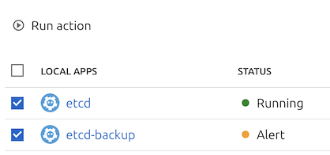

### Viewing action logs

Once an action has been triggered, the action log displays the status and latest result of the action.

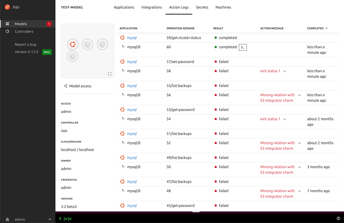

## Common questions and problems

### Why can't I access the dashboard?

To be able to access the dashboard that is deployed on a local controller make sure you run the `juju dashboard` command from the same computer as your web browser. This will set up a secure proxy to the dashboard.

If you’re having trouble accessing the dashboard on [JAAS](http://jaas.ai) then get in touch on [Juju Discourse](https://discourse.charmhub.io/) or find us on [Matrix](https://matrix.to/#/#charmhub-juju:ubuntu.com).

### Why can't I log in to the dashboard?

If you’ve set up a local controller and this is your first time logging in, make sure you’ve set up a password in Juju with `juju change-user-password {ref}`your-username]`

### How do I deploy the dashboard?

The dashboard can be deployed on a controller model using the `juju-dashboard` or `juju-dashboard-k8s` charm. See the [deployment instructions](https://juju.is/docs/juju/manage-the-juju-dashboard#heading--set-up-the-dashboard) for full details.

### How do I make the dashboard accessible over the network?

To make the dashboard available over your network without using the `juju dashboard` command you will need to [set up a secure proxy](https://juju.is/docs/juju/manage-the-juju-dashboard#heading--access-without-the-cli).

### Why can't I see the web CLI?

If you’re trying to access the web CLI on a local controller, make sure there is nothing blocking the model’s `/commands` websocket.

At the time of writing the web CLI is not available on JAAS.

### Why can't I see the machine views?

The machine views are only available when using the dashboard with machine
charms, and is not available when using a Kubernetes deployment.
