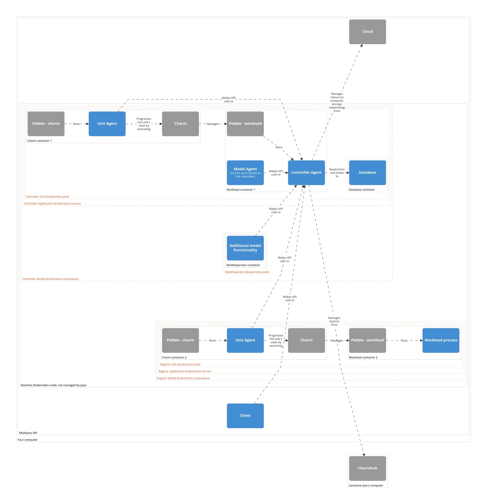
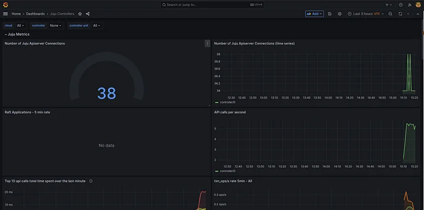

(tutorial)=
# Get started with Juju

Imagine your business needs a chat service such as Mattermost backed up by a database such as PostgreSQL. In a traditional setup, this can be quite a challenge, but with Juju you'll find yourself deploying, configuring, scaling, integrating, etc., applications in no time. Let's get started!


```{note}
The tutorial will take about 1h to complete. 

If you'd like a quicker start:
- Ignore the "Look around" expand boxes.
- Try instead [GitHub | Juju > Give it a try](https://github.com/juju/juju?tab=readme-ov-file#give-it-a-try).

At any point, to ask for help or give feedback or contribute: Get in touch: {ref}`project-and-community`.
```


**What you'll need:** 
- A workstation, e.g., a laptop, that has sufficient resources to launch a virtual machine with 4 CPUs, 8 GB RAM, and 50 GB disk space.

**What you'll do:**
- Set up an isolated test environment with Multipass and the `charm-dev` blueprint, which will provide all the necessary tools and configuration for the tutorial (a localhost machine cloud and Kubernetes cloud, Juju, etc.). *Note: The tutorial focuses on Juju charm deployment, making how to bootstrap a Juju controller on a specific cloud out-of-scope.*

- Plan, deploy, and maintain a chat service based on Mattermost and backed by PostgreSQL on a local Kubernetes cloud with Juju.


## Set up an isolated test environment

On your machine, install Multipass and use it to set up an Ubuntu virtual machine (VM) called `my-juju-vm` from the `charm-dev` blueprint. 

> See more: {ref}`manage-your-deployment-environment` > Set things up (automatically)
> 
> Note: This document also contains a manual path, using which you can set things up without the Multipass VM or the `charm-dev` blueprint. However, please note that the manual path may yield slightly different results that may impact your experience of this tutorial. For best results we strongly recommend the automatic path, or else suggest that you follow the manual path in a way that stays very close to [the definition of the `charm-dev` blueprint](https://github.com/canonical/multipass-blueprints/blob/ae90147b811a79eaf4508f4776390141e0195fe7/v1/charm-dev.yaml#L134).


## Plan


In this tutorial your goal is to set up a chat service on a cloud. 


First, decide which cloud (i.e., anything that provides storage, compute, and networking) you want to use. Juju supports a long list of clouds; in this tutorial we will use a low-ops, minimal production Kubernetes called 'MicroK8s'. In a terminal, open a shell into your VM and verify that you already have MicroK8s installed (`microk8s version`). 

> See more: {ref}`cloud`, {ref}`list-of-supported-clouds`, {ref}`cloud-kubernetes-microk8s`, {ref}`manage-your-deployment-environment`> steps 3-4 


Next, decide which charms (i.e., software operators) you want to use. Charmhub provides a large collection. For this tutorial we will use `mattermost-k8s`  for the chat service,  `postgresql-k8s` for its backing database, and `self-signed-certificates` to TLS-encrypt traffic from PostgreSQL.


> See more: {ref}`charm`, [Charmhub](https://charmhub.io/), Charmhub | [`mattermost-k8s`](https://charmhub.io/mattermost-k8s), [`postgresql-k8s`](https://charmhub.io/postgresql-k8s), [`self-signed-certificates`](https://charmhub.io/self-signed-certificates)


```{dropdown} Look around
**1. Learn more about your MicroK8s cloud.**<br>
**1a.** Find out more about its snap: `snap info microk8s`.<br>
**1b.** Find out the installed version: `microk8s version`.<br>
**1c.** Check its enabled addons: `microk8s status`.<br>
**1d.** Inspect its `.kube/config` file: `cat ~/.kube/config`.<br>
**1e.** Try `microk8s kubectl`; you won't need it once you have Juju, but it's there anyway.<br>
```


## Deploy


You will need to install a Juju client; on the client, add your cloud and cloud credentials; on the cloud, bootstrap a controller (i.e., control plane); on the controller, add a model (i.e., canvas to deploy things on; namespace); on the model, deploy, configure, and integrate the charms that make up your chat service. 

The blueprint used to launch your VM has ensured that most of these things are already in place for you -- verify that you have a Juju client, that it knows about your MicroK8s cloud and cloud credentials, that the MicroK8s cloud already has a controller bootstrapped on it, and that the Microk8s controller already has a model on it. 

Just for practice, bootstrap a new controller and model with more informative names -- a controller called `31microk8s` (reflecting the version of Juju that came with your VM and the cloud that the controller lives on) and a model called `chat` (reflecting the fact that we intend to use it for applications related to a chat service). 

Finally, go ahead and deploy, configure, and integrate your charms.

Sample session (yours should look very similar):


```{tip}
Split your terminal window into three. In all, access your Multipass VM shell (`multipass shell my-juju-vm`) and then: 

**Shell 1:** Keep using it as you've already been doing so far, namely to type the commands in this tutorial.

**Shell 2:**  Run `juju status --relations --watch 1s` to watch your deployment status evolve. (Things are all right if your `App Status` and your `Unit - Workload` reach `active` and your `Unit - Agent` reaches `idle`. See more: {ref}`status`.

**Shell 3:** Run `juju debug-log` to watch all the details behind your deployment status. (Especially useful when things don't evolve as expected. In that case, please get in touch.)
```


```text
# Verify that you have the juju client installed:
ubuntu@my-juju-vm:~$ juju version
3.1.8-genericlinux-amd64

# Verify that the client already knows about your microk8s cloud:
ubuntu@my-juju-vm:~$ juju clouds
# (Ignore the client-controller distinction for now --it'll make sense in a bit.)
Only clouds with registered credentials are shown.
There are more clouds, use --all to see them.

Clouds available on the controller:
Cloud     Regions  Default    Type
microk8s  1        localhost  k8s  

Clouds available on the client:
Cloud      Regions  Default    Type  Credentials  Source    Description
localhost  1        localhost  lxd   1            built-in  LXD Container Hypervisor
microk8s   1        localhost  k8s   1            built-in  A Kubernetes Cluster


# Verify that the client already knows about your microk8s credentials:
ubuntu@my-juju-vm:~$ juju credentials
# (Ignore the client-controller distinction for now --it'll make sense in a bit.)
Controller Credentials:
Cloud     Credentials
microk8s  microk8s

Client Credentials:
Cloud      Credentials
localhost  localhost*
microk8s   microk8s*
ubuntu@my-juju-vm:~$ juju controllers
Use --refresh option with this command to see the latest information.

Controller  Model        User   Access     Cloud/Region         Models  Nodes    HA  Version
lxd         welcome-lxd  admin  superuser  localhost/localhost       2      1  none  3.1.8  
microk8s*   welcome-k8s  admin  superuser  microk8s/localhost        2      1     -  3.1.8  
ubuntu@my-juju-vm:~$ 

# Bootstrap a new controller:
ubuntu@my-juju-vm:~$ juju bootstrap microk8s 31microk8s
Creating Juju controller "31microk8s" on microk8s/localhost
Bootstrap to Kubernetes cluster identified as microk8s/localhost
Creating k8s resources for controller "controller-31microk8s"
Starting controller pod
Bootstrap agent now started
Contacting Juju controller at 10.152.183.71 to verify accessibility...

Bootstrap complete, controller "31microk8s" is now available in namespace "controller-31microk8s"

Now you can run
	juju add-model <model-name>
to create a new model to deploy k8s workloads.

# Create a new model:
ubuntu@my-juju-vm:~$ juju add-model chat
Added 'chat' model on microk8s/localhost with credential 'microk8s' for user 'admin'

# Deploy mattermost-k8s:
ubuntu@tutorial-vm:~$ juju deploy mattermost-k8s
Located charm "mattermost-k8s" in charm-hub, revision 27
Deploying "mattermost-k8s" from charm-hub charm "mattermost-k8s", revision 27 in channel stable on ubuntu@20.04/stable

# Deploy and configure postgresql-k8s:
ubuntu@tutorial-vm:~$ juju deploy postgresql-k8s --channel 14/stable --trust --config profile=testing
Located charm "postgresql-k8s" in charm-hub, revision 193
Deploying "postgresql-k8s" from charm-hub charm "postgresql-k8s", revision 193 in channel 14/stable on ubuntu@22.04/stable

# Deploy self-signed-certificates:
ubuntu@my-juju-vm:~$ juju deploy self-signed-certificates
Located charm "self-signed-certificates" in charm-hub, revision 72
Deploying "self-signed-certificates" from charm-hub charm "self-signed-certificates", revision 72 in channel stable on ubuntu@22.04/stable

# Integrate self-signed-certificates with postgresql-k8s:
ubuntu@tutorial-vm:~$ juju integrate self-signed-certificates postgresql-k8s 

# Integrate postgresql-k8s with mattermost-k8s:
ubuntu@tutorial-vm:~$ juju integrate postgresql-k8s:db mattermost-k8s 

# Check your model's status:
ubuntu@my-juju-vm:~$ juju status --relations
Model  Controller  Cloud/Region        Version  SLA          Timestamp
chat   31microk8s  microk8s/localhost  3.1.8    unsupported  13:48:04+02:00

App                       Version                         Status  Scale  Charm                     Channel    Rev  Address         Exposed  Message
mattermost-k8s            .../mattermost:v8.1.3-20.04...  active      1  mattermost-k8s            stable      27  10.152.183.131  no       
postgresql-k8s            14.10                           active      1  postgresql-k8s            14/stable  193  10.152.183.56   no       
self-signed-certificates                                  active      1  self-signed-certificates  stable      72  10.152.183.119  no       

Unit                         Workload  Agent  Address      Ports     Message
mattermost-k8s/0*            active    idle   10.1.32.155  8065/TCP  
postgresql-k8s/0*            active    idle   10.1.32.152            
self-signed-certificates/0*  active    idle   10.1.32.154            

Integration provider                   Requirer                       Interface         Type     Message
postgresql-k8s:database-peers          postgresql-k8s:database-peers  postgresql_peers  peer     
postgresql-k8s:db                      mattermost-k8s:db              pgsql             regular  
postgresql-k8s:restart                 postgresql-k8s:restart         rolling_op        peer     
postgresql-k8s:upgrade                 postgresql-k8s:upgrade         upgrade           peer     
self-signed-certificates:certificates  postgresql-k8s:certificates    tls-certificates  regular  
```


From the output of `juju status`> `Unit` > `mattermost-k8s/0`, retrieve the IP address and the port and feed them to `curl` on the template below:

```text
curl <IP address>:<port number>/api/v4/system/ping
```

Sample session:

```text
ubuntu@my-juju-vm:~$ curl 10.1.32.155:8065/api/v4/system/ping
{"ActiveSearchBackend":"database","AndroidLatestVersion":"","AndroidMinVersion":"","IosLatestVersion":"","IosMinVersion":"","status":"OK"}
```

Congratulations, your chat service is up and running!




*Your computer with your Multipass VM, your MicroK8s cloud, and a  live Juju controller (the 'charm' in the Controller Unit is the `juju-controller` charm) + a sample deployed application on it (the 'charm' in the Regular Unit stands for any charm that you might deploy). If in the Regular Application you replace the charm with `mattermost-k8s` and image a few more Regular Applications where you replace the charm with `postgresql-k8s` and, respectively, `self-signed-certificates`, and if you trace the path from `postgresql-k8s`'s Unit Agent through the Controller Agent to `self-signed-certificates`'s and, respectively, `mattermost-k8s` Unit Agent, you get a full representation of your deployment. (Note: After integration, the workloads may also know how to contact each other directly; still, all communication between their respective charms goes through the Juju controller and the result of that communication is stored in the database in the form of maps known as 'relation data bags'.)* 


> See more: {ref}`manage-your-deployment-environment`, {ref}`manage-juju`, {ref}`manage-clouds`, {ref}`manage-credentials`, {ref}`manage-controllers`, {ref}`manage-models`, {ref}`manage-applications`

```{dropdown} Look around

**1.** **Learn more about `juju`.** <br>
**1a.** Find out more about its snap: `snap info juju`. <br>
**1b.** Find out the installed version: `juju version`. <br>
**1c.** Quickly preview all the commands: `juju help commands`. <br>
**1d.** Filter by keyword: Use `juju help commands | grep <keyword>` to get a quick sense of the commands related to a particular keyword (e.g., "secret"). Try ` juju help commands | grep -v Alias` to exclude any aliases. <br>
**1e.** Find out more about a specific command: `juju help <command>`.<br>
**1f.** Inspect the files on your workstation associated with the client: `ls ~/.local/share/juju`.<br>
**1g.** Learn about other Juju clients: [terraform-provider-juju](https://canonical-terraform-provider-juju.readthedocs-hosted.com/en/latest/tutorial/), [Python Libjuju](https://pythonlibjuju.readthedocs.io/en/latest/). <p>

**2.** **Learn more about your cloud definition and credentials *in* Juju.** <br>
**2a.** Find out more about the Juju notion of a cloud: {ref}`cloud`.<br>
**2b.** Find out all the clouds whose definitions your client has already: `juju clouds`, `juju clouds --all`. <br>
**2c.** Take a look at how Juju has defined your MicroK8s cloud: `juju show-cloud microk8s`, `juju credentials`, `juju show-credential microk8s microk8s --show-secrets`. :warning: In Juju, the term 'credential' is always about access to a cloud.<br>
**2d.** Revisit the output for `juju clouds` or `juju credentials`. Notice the classification into client vs. controller. All this classification does is keep track of who is aware of a given cloud definition / credential -- the client, the controller, or both. However, this simple distinction has important implications -- can you guess which? You can use the same controllers to run multiple clouds and you can decide which cloud account to use.

**3.** **Learn more about Juju controllers.** <br>
**3a.** Find out all the controllers that your client is aware of already: `juju controllers`. Switch to the LXD cloud controller, then back: `juju switch lxd`, `juju switch microk8s`. Get more detail on each controller: `juju show-controller <controller name>`. Take a sneak peek at their current configuration: `cat ~/.local/share/juju/bootstrap-config.yaml`. <br>
**3b.** Revisit the output for `juju controllers`. Note the `User` and `Access` columns. In Juju, a user is any person able to at least log in to a Juju controller. Run `juju whoami`, then `juju show-user admin` – as you can see, your user is called `admin` and has `superuser` access to the controller. <p>

**4.** **Learn more about Juju models, applications, units.** <br>
**4a.** Find out all the models on your `microk8s` controller: `juju models`. <br>
**4b.** Find out more about your `chat` model: `juju show-model`, `juju status -m microk8s:chat`. What do you think a model is? A model is a logical abstraction. It denotes a workspace, a canvas where you deploy, integrate, and manage applications. On a Kubernetes cloud, a Juju model corresponds to a Kubernetes namespace. Run `microk8s kubectl get namespaces` to verify -- the output should show a namespace called `chat`, for your `chat` model, and also a namespace called `controller-microk8s`, for your `controller` model.<br>
**4c.** Try to guess: What is the `controller` model about? Switch to it and check: `juju switch microk8s:controller`, then `juju status`. When you bootstrap a controller into a cloud, this by default creates the `controller` model and deploys to it the `juju-controller` charm, whose units (=running instances of a charm) form the `controller` application. Find out more about the controller charm: `juju info juju-controller` or [Charmhub | `juju-controller`](https://charmhub.io/juju-controller). Find out more about the controller application: `juju show-application controller`. SSH into a controller application unit: `juju ssh controller/0`, then poke around using [`ls`](https://man7.org/linux/man-pages/man1/ls.1.html), [`cd`](https://man7.org/linux/man-pages/man1/cd.1p.html), and [`cat`](https://man7.org/linux/man-pages/man1/cat.1.html) (type `exit` to exit the unit). On a Kubernetes cloud, a Juju unit corresponds to a pod: `microk8s kubectl -n controller-microk8s get pods` should show a `controller-0` pod, which is the Kubernetes pod corresponding to the `controller/0` unit. <br>
**4d.** Switch back to the `chat` model. Tip: When you're on the same controller, you can skip the controller prefix when you specify the model to switch to.
```

## Maintain


### Scale


A database failure can be very costly. Let's scale it! 

Sample session:

```text
ubuntu@my-juju-vm:~$ juju scale-application postgresql-k8s 3
postgresql-k8s scaled to 3 units

# Wait a minute for things to settle down, then check the result:
ubuntu@my-juju-vm:~$ juju status
Model  Controller  Cloud/Region        Version  SLA          Timestamp
chat   31microk8s  microk8s/localhost  3.1.8    unsupported  15:41:34+02:00

App                       Version                         Status  Scale  Charm                     Channel    Rev  Address         Exposed  Message
mattermost-k8s            .../mattermost:v8.1.3-20.04...  active      1  mattermost-k8s            stable      27  10.152.183.131  no       
postgresql-k8s            14.10                           active      3  postgresql-k8s            14/stable  193  10.152.183.56   no       
self-signed-certificates                                  active      1  self-signed-certificates  stable      72  10.152.183.119  no       

Unit                         Workload  Agent      Address      Ports     Message
mattermost-k8s/0*            active    idle       10.1.32.155  8065/TCP  
postgresql-k8s/0*            active    idle       10.1.32.152            Primary
postgresql-k8s/1             active    idle       10.1.32.158            
postgresql-k8s/2             active    executing  10.1.32.159            
self-signed-certificates/0*  active    idle       10.1.32.154            

```

As you might have guessed, the result of scaling an application is that you have multiple running instances of your application -- that is, multiple units. 

```{caution} In a production scenario:
You'll want to make sure that they are also properly distributed over multiple nodes. Our localhost MicroK8s doesn't allow us to do this (because we only have 1 node) but, if you clusterise MicroK8s, you can use it to explore this too!
> See more: [MicroK8s | Create a multi-node cluster](https://microk8s.io/docs/clustering)
```

> See more: {ref}`manage-applications` > Scale


### Perform a custom action

In Juju, performing most major operations looks the same for every charm. However, charmers sometimes also define additional operations specific to a given charm. These operations are called actions and often have to do with accessing an application deployed by a charm, creating a backup, etc. Below, use the `postgresql-k8s` charm's `set-password` action to generate a password for the default, `operator` username, then use the username and password to access the PostgreSQL application.


First, get:

- the host IP address of the PostgreSQL unit: retrieve it from `juju status` or `juju show-unit` (in the sample outputs above, `10.1.32.152`);

-  a PostgreSQL username and password: we can use the internal, default user called `operator` and set a password for it using the `set-password` action. Sample session:

```
juju run postgresql-k8s/leader set-password username=operator password=mysecretpass
```


Now, use this information to access the PostgreSQL application:

First, ssh into the PostgreSQL unit (= Kubernetes container). Sample session:

```text
ubuntu@my-juju-vm:~$ juju ssh --container postgresql postgresql-k8s/leader bash
root@postgresql-k8s-0:/#
```

Verify that `psql` is already installed. Sample session:

```text
root@postgresql-k8s-0:/# psql --version
psql (PostgreSQL) 14.10 (Ubuntu 14.10-0ubuntu0.22.04.1)
```

Use `psql` to view a list of the existing databases. Sample session (make sure to use your own host and password):

```text
root@postgresql-k8s-0:/# psql --host=10.1.32.152 --username=operator --password --list
Password: 
                               List of databases
   Name    |  Owner   | Encoding | Collate |  Ctype  |    Access privileges     
-----------+----------+----------+---------+---------+--------------------------
 postgres  | operator | UTF8     | C       | C.UTF-8 | operator=CTc/operator   +
           |          |          |         |         | backup=CTc/operator     +
           |          |          |         |         | replication=CTc/operator+
           |          |          |         |         | rewind=CTc/operator     +
           |          |          |         |         | monitoring=CTc/operator +
           |          |          |         |         | admin=c/operator
 template0 | operator | UTF8     | C       | C.UTF-8 | =c/operator             +
           |          |          |         |         | operator=CTc/operator
 template1 | operator | UTF8     | C       | C.UTF-8 | =c/operator             +
           |          |          |         |         | operator=CTc/operator
(3 rows)
```

Finally, use `psql` to access the `postgres` database and submit a query. Sample session:

```text
root@postgresql-k8s-0:/# psql --host=10.1.32.152 --username=operator --password postgres
Password: 
psql (14.10 (Ubuntu 14.10-0ubuntu0.22.04.1))
Type "help" for help.

postgres=# SELECT version();
                                                               version                                                              
  
                                                                version                                                                 
----------------------------------------------------------------------------------------------------------------------------------------
 PostgreSQL 14.10 (Ubuntu 14.10-0ubuntu0.22.04.1) on x86_64-pc-linux-gnu, compiled by gcc (Ubuntu 11.4.0-1ubuntu1~22.04) 11.4.0, 64-bit
(1 row)

```

Type `exit` to get back to your unit shell and then again to return to your Multipass VM shell.


> See more: 
> - [Charmhub | `postgresql-k8s` > Actions > `set-password`](https://charmhub.io/postgresql-k8s/actions#set-password) (or run `juju actions postgresql-k8s` followed by `juju show-action postgresql-k8s set-password`)
> - {ref}`manage-actions`


### Upgrade


Juju releases keep coming and going but our deployment is still stuck on Juju 3.1.8 (i.e., major version 3, minor version 1, patch version 8). Time to upgrade!

To upgrade a deployment, we must upgrade the client, the version of the Juju agents in the controller model, the version of the Juju agents in non-controller models, (if on a machine cloud, the base of the machine), and the charms. 

These upgrades don't all have to happen at once, but it mostly makes sense to do them in this order. And, if upgrading an agent's minor or major version of a controller / model, you must know that the only option is to upgrade the controller/model to the latest patch version of the old minor or major, then bootstrap a new controller and migrate the model to it, then upgrade the model to the current patch version of the new controller.

Let's give it a try!

```{caution} 
The running processes in your Shells 2 and 3  will block your client upgrade. To prevent that, in each one, hit the `C-c` key combination to stop them for the duration of the client upgrade, the restart them by running again `juju status --relations --watch 1s` and, respectively, `juju debug-log`.
```


Sample session:

```text
# Check the current client version
ubuntu@my-juju-vm:~$ juju version
3.1.8-genericlinux-amd64

# Upgrade the client to the the latest stable minor of 3:
ubuntu@my-juju-vm:~$ sudo snap refresh juju --channel 3/stable
juju (3/stable) 3.4.2 from Canonical✓ refreshed


# Check the current controller model agent version:
ubuntu@my-juju-vm:~$ juju show-controller
# Partial output:
31microk8s:
  details:
    ...
    agent-version: 3.1.8
    agent-git-commit: 810900f47952a1f3835576f57dce2f9d1aef23d0
    controller-model-version: 3.1.8
    ...
	
# Upgrade the controller model agents 
# to the latest patch version of the same minor:
# (This will be necessary in a bit for model migration.)
ubuntu@my-juju-vm:~$ juju upgrade-controller --agent-version 3.1.8
# No change because 3.1.8 is already the latest patch version of 3.1:
no upgrades available

# Use the upgraded 3.4.2 client to bootstrap 
# a new controller into microk8s, '34microk8s':
ubuntu@my-juju-vm:~$ juju bootstrap microk8s 34microk8s
Creating Juju controller "34microk8s" on microk8s/localhost
Bootstrap to Kubernetes cluster identified as microk8s/localhost
Creating k8s resources for controller "controller-34microk8s"
Downloading images
Starting controller pod
Bootstrap agent now started
Contacting Juju controller at 10.152.183.187 to verify accessibility...

Bootstrap complete, controller "34microk8s" is now available in namespace "controller-34microk8s"

Now you can run
	juju add-model <model-name>
to create a new model to deploy k8s workloads.

# Verify the version of the new controller:
ubuntu@my-juju-vm:~$ juju show-controller 34microk8s
# Partial output:
34microk8s:
  details:
    ...
    agent-version: 3.4.2
    agent-git-commit: a80becbb4da5985fa53c63824a4bd809e9d03954
    controller-model-version: 3.4.2
    ...

# Switch back to the old controller: 
ubuntu@my-juju-vm:~$ juju switch 31microk8s:admin/chat
34microk8s (controller) -> 31microk8s:admin/chat

# Check the current non-controller model version for the 'chat' model:
ubuntu@my-juju-vm:~$ juju show-model
# Partial output:
chat:
  name: admin/chat
  ...
  agent-version: 3.1.8

# Upgrade the non-controller model agents 
# to the latest patch version of the same minor:
ubuntu@my-juju-vm:~$ juju upgrade-model --agent-version 3.1.8
# No change because 3.1.8 is already the latest patch version of 3.1:
no upgrades available

# Migrate your 'chat' model to the new, 34microk8s controller:
ubuntu@my-juju-vm:~$ juju migrate chat 34microk8s
Migration started with ID "43c29d63-77f3-4665-82bc-e21b55ab4d6a:0"
# This may take a little bit of time
# but, when it's done,
# your 'chat' model will disappear from the old controller
# and appear on the new controller.

# Switch to the new controller:
ubuntu@my-juju-vm:~$ juju switch 34microk8s:admin/chat
34microk8s (controller) -> 34microk8s:admin/chat

# Verify that your 'chat' model has successfully migrated:
ubuntu@my-juju-vm:~$ juju models
Controller: 34microk8s

Model       Cloud/Region        Type        Status     Units  Access  Last connection
chat*       microk8s/localhost  kubernetes  available  5       admin  8 minutes ago
controller  microk8s/localhost  kubernetes  available  1       admin  just now

# Upgrade your 'chat' model's patch version 
# to match that of the new controller:
ubuntu@my-juju-vm:~$ juju upgrade-model --agent-version 3.4.2
best version:
    3.4.2
started upgrade to 3.4.2

# Run 'juju status' to inspect your charm's current channel,
# compare to 'juju info <charm>' to find out the latest channels,
# or just try:
ubuntu@my-juju-vm:~$ juju refresh mattermost-k8s
charm "mattermost-k8s": already up-to-date
ubuntu@my-juju-vm:~$ juju refresh postgresql-k8s
charm "postgresql-k8s": already up-to-date
ubuntu@my-juju-vm:~$ juju refresh self-signed-certificates
charm "self-signed-certificates": already up-to-date
# No surprise there -- our deployment is quite fresh, 
# so no immediate need for charm upgrades!
```


> See more: {ref}`juju-roadmap-and-releases`, {ref}`juju-cross-version-compatibility`, {ref}`upgrade-your-deployment`


### Observe


Our deployment hasn't really been up very long, but we'd still like to take a closer look at our controller, to see what's happening. Time for observability!


```text
# Add a new model to hold your observability applications:
ubuntu@my-juju-vm:~$ juju add-model observability
Added 'observability' model on microk8s/localhost with credential 'microk8s' for user 'admin'

# Inspect the results:
ubuntu@my-juju-vm:~$ juju models
Controller: 34microk8s

Model           Cloud/Region        Type        Status     Units  Access  Last connection
chat            microk8s/localhost  kubernetes  available  5       admin  9 minutes ago
controller      microk8s/localhost  kubernetes  available  1       admin  just now
observability*  microk8s/localhost  kubernetes  available  6       admin  1 minute ago

# Deploy to it the cos-lite bundle:
ubuntu@my-juju-vm:~$ juju deploy cos-lite --trust
# Partial output:
Located bundle "cos-lite" in charm-hub, revision 11
Located charm "alertmanager-k8s" in charm-hub, channel latest/stable
Located charm "catalogue-k8s" in charm-hub, channel latest/stable
Located charm "grafana-k8s" in charm-hub, channel latest/stable
Located charm "loki-k8s" in charm-hub, channel latest/stable
Located charm "prometheus-k8s" in charm-hub, channel latest/stable
Located charm "traefik-k8s" in charm-hub, channel latest/stable
...
Deploy of bundle completed.

# Offer prometheus' metrics-endpoint endpoint
# for cross-model relations:
ubuntu@my-juju-vm:~$ juju offer prometheus:metrics-endpoint
Application "prometheus" endpoints [metrics-endpoint] available at "admin/observability.prometheus"

# Switch to the controller model
ubuntu@my-juju-vm:~$ juju switch controller
34microk8s:admin/observability -> 34microk8s:admin/controller

# Integrate the controller application with the prometheus offer:
ubuntu@my-juju-vm:~$ juju integrate controller admin/observability.prometheus

# Examine the result:
ubuntu@my-juju-vm:~$ juju status --relations
Model       Controller  Cloud/Region        Version  SLA          Timestamp
controller  34microk8s  microk8s/localhost  3.4.2    unsupported  17:08:10+02:00

SAAS        Status  Store       URL
prometheus  active  34microk8s  admin/observability.prometheus

App         Version  Status  Scale  Charm            Channel     Rev  Address  Exposed  Message
controller           active      1  juju-controller  3.4/stable   79           no       

Unit           Workload  Agent  Address      Ports      Message
controller/0*  active    idle   10.1.32.161  37017/TCP  

Integration provider         Requirer                     Interface          Type     Message
controller:metrics-endpoint  prometheus:metrics-endpoint  prometheus_scrape  regular  

# Switch back to the observability model:
ubuntu@my-juju-vm:~$ juju switch observability
34microk8s:admin/controller -> 34microk8s:admin/observability

# Get an admin password for grafana:
ubuntu@my-juju-vm:~$ juju run grafana/0 get-admin-password
# Example output:
Running operation 1 with 1 task
  - task 2 on unit-grafana-0

Waiting for task 2...
admin-password: 0OpLUlxJXQaU
url: http://10.238.98.110/observability-grafana
```

On your local machine, open a browser window and copy-paste the Grafana URL. In the username field, enter 'admin'. In the password field, enter the `admin-password`. If everything has gone well, you should now be logged in. 

On the new screen, in the top-right, click on the Menu icon, then **Dashboards**. Then, on the new screen, in the top-left, click on **New**, **Upload dashboard JSON file**, and upload the JSON Grafana-dashboard-definition file below, then, in the IL3-2 field, from the drop-down, select the suggested `juju_observability...` option. 

[Juju Controllers-1713888589960.json|attachment](https://discourse.charmhub.io/uploads/short-url/yOxvgum6eo3NmMxPaTRKLOLmbo0.json) (200.9 KB)


On the new screen, at the very top, expand the Juju Metrics section and inspect the results. How many connections to the API server does your controller show? 



Make a change to your controller (e.g., run `juju add-model test` to add another model and trigger some more API server connections) and refresh the page to view the updated results!

Congratulations, you now have a functional observability setup! But your controller is not the only thing that you can monitor -- go ahead and try to monitor something else, for example, your PostgreSQL!


> See more: {ref}`collect-metrics-about-a-controller`


## Tear down your test environment


To tear things down, remove your entire Multipass Ubuntu VM, then uninstall Multipass:

> See more: {ref}`manage-your-deployment-environment` > Tear things down (automatically)


## Next steps

This tutorial has introduced you to the basic things you can do with `juju`. But there is a lot more to explore:

| If you are wondering... | visit our...                          |
|-------------------------|---------------------------------------|
| "How do I...?"          | [How-to docs](howto/index)            |
| "What is...?"           | [Reference docs](reference/index)     |
| "Why...?", "So what?"   | [Explanation docs](explanation/index) |


